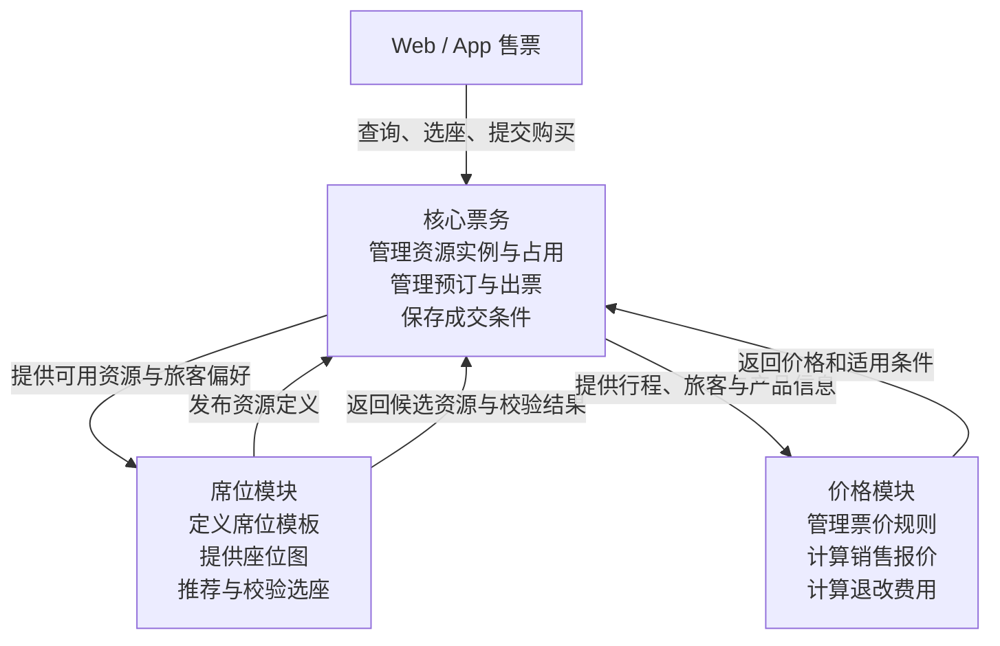
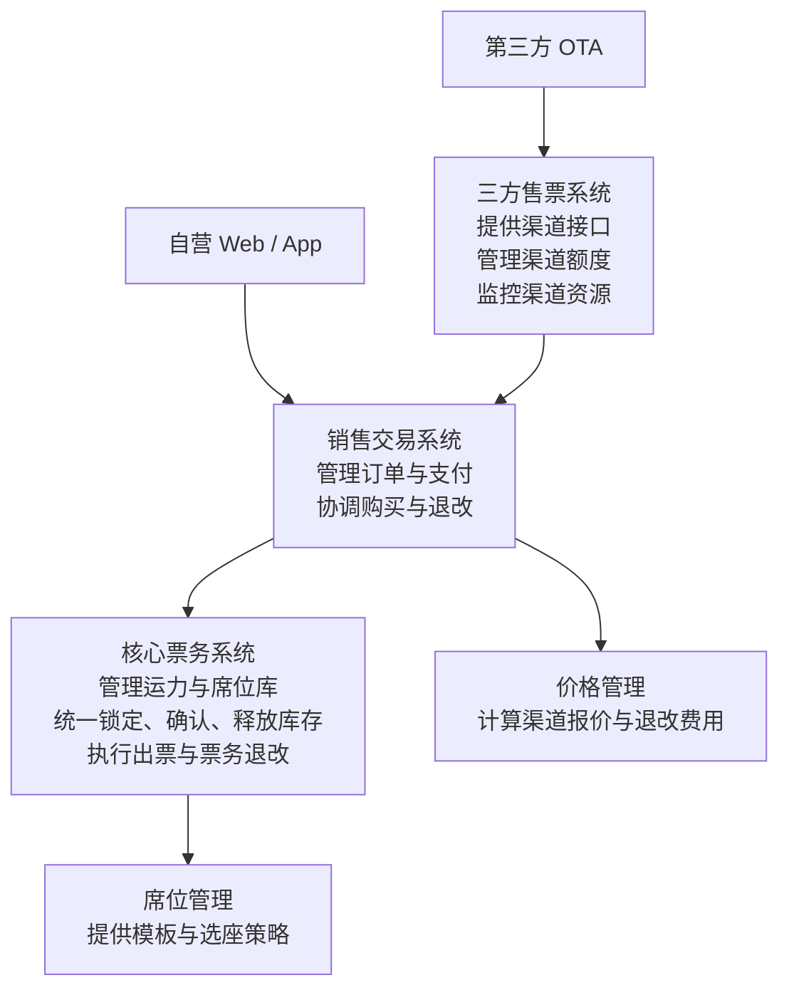

# 海外铁路票务系统设计与模拟器 · 聊天历史原文

## 归档范围

- 来源：本会话的本地消息记录。
- 时间：2026-09-15 16:47:18 +08:00 至 2026-09-18 09:40:14 +08:00。
- 收录：用户消息 30 条，助手正式答复 29 条，共 30 轮；最后一轮为本次归档请求，尚无对应正式答复。
- 用户提问和正式答复正文按原文保存；不包含系统／开发者指令、环境消息、工具调用、内部推理及执行中的进度提示。
- 原文中的本机绝对路径、旧版本链接和 localhost 地址保持原样，换电脑后不一定可用。架构附件副本见 [附件索引](附件索引.md)，当前代码在上级目录。
- 这是一份历史记录，不代表所有历史建议同时有效。继续工作请先阅读 [项目交接说明](项目交接说明.md)，较晚的澄清优先于较早的建议。
- 机器可读原文见 [聊天历史.json](聊天历史.json)。未将聊天内容改写成摘要。

## 对话目录

- [第 01 轮 · https://claude.com/blog/the-ai-native-sdlc-playbook(https://claude.com](#round-01)
- [第 02 轮 · 各阶段详细介绍一下](#round-02)
- [第 03 轮 · 这是我对海外铁路票务系统的设计方案，还有很多没有设计完毕，分析一下](#round-03)
- [第 04 轮 · 针对上述优化内容，直接优化该图](#round-04)
- [第 05 轮 · 要做到尽量兼容不同海外国家的个性化需求，包括不同的席位等级，不同的票价策略，不同的选座需求，不同的支付方式和币种，不同的语言，不同的UI界面](#round-05)
- [第 06 轮 · 现在的子图太多了，我只需要一两张图来勾画整个海外票务系统的整体架构](#round-06)
- [第 07 轮 · 现有的海外票务系统大体上分作两大系统，一个是后台票务核心，负责整合运力和席位资源形成席位库，席位库通过定时任务计算出余票存入余票库，另一个是](#round-07)
- [第 08 轮 · 在此基础之上，票价和运力产品（如车厢、席位类型）根据所在国的情况各有不同，要兼容不同特点，应该从核心系统中独立出来，或者要标准化，并在所在国](#round-08)
- [第 09 轮 · 图中的标准契约是否有国际标准可以遵守，该如何设计这个契约？](#round-09)
- [第 10 轮 · 我还是不能理解上述内容，我目前关心核心票务系统如果不包含席位管理和价格管理，那么彼此之间应该如何协调，核心应该包括哪些能力，价格管理包括哪些](#round-10)
- [第 11 轮 · 1、线路、车站、运营企业等数据管理，车次管理，车次与车厢的关联，以及根据当前运力生成席位库，这些都作为核心票务的能力。2、不同国家会有不同的](#round-11)
- [第 12 轮 · 上述内容中，我将票务销售交易单独作为一个子系统，交易系统，与核心系统、席位管理、价格管理并列，是否合理？OSDM中三个角色是同时存在的吗，还](#round-12)
- [第 13 轮 · 销售订单和票务预订区别是什么？预定就是在预售期内购买车票并支付，也就是销售，为什么还要做区分？是否可以理解为临时订单？](#round-13)
- [第 14 轮 · 之前说的票务预订到底是做什么的，必要性如何？为什么锁票必须由核心系统负责，销售系统不行吗？](#round-14)
- [第 15 轮 · 我还希望增加一个三方售票系统，负责其他渠道的售票，该系统主要提供OTA接口让第三方通过调用接口在其渠道实现售票，另外该系统也提供渠道额度管理](#round-15)
- [第 16 轮 · 另外，还需要给用户提供API接口，用户可以自定义开发售票系统，但不是核心系统，因此需要一个API监控和管理系统，基于以上设计重新刷新](#round-16)
- [第 17 轮 · 当前的API管理只是APi Gateway这一层，但是底层能力是依托那一层实现的 ？](#round-17)
- [第 18 轮 · 在不同国家落地时，支持根据当地国家情况定制坐席排布，以及选座偏好；支持根据需要进行票价定制和扩展开发，从而支持票价浮动；支持根据当地国家需要](#round-18)
- [第 19 轮 · 乘车权益账属于哪个功能模块？权益类产品的订单是否要单独管理？如果根据需要还要扩展餐饮、购物、酒店预定、其他出行方式购票、多式联运等，对当前功](#round-19)
- [第 20 轮 · 所以，现在到底有哪几个功能模块，列举出来，各自负责哪些能力，彼此之间如何协同。列举主要的业务流程。](#round-20)
- [第 21 轮 · 1、**API 管理与监控中心 和&#x20;**&#x5F00;放售票与渠道管理 都是管理API，分成两个有必要吗？2、销售交易系统为什么](#round-21)
- [第 22 轮 · 划分子系统或者模块的重要依据是，当在不同国家实施时，不需要针对当地特殊需求对所有模块都做适配改造，而只需要改动部分模块，做本地定制化开发即可](#round-22)
- [第 23 轮 · 如何核心系统包括库存管理，那么针对不同国家不同车厢类型对应的库存如何注册到核心系统，让核心系统知道某车次的内部坐席有多少种等级，每种等级有多](#round-23)
- [第 24 轮 · 关于席位要解决的关键问题是，不同国家不同车厢类型，席位或者铺位的排布方式不同，这样会影响到旅客选座界面，这部分人工选座的界面可以单独开发而不](#round-24)
- [第 25 轮 · 规则可以有很多，核心系统如何识别规则做判断](#round-25)
- [第 26 轮 · 同理，价格系统如何做到与核心系统独立，且可以针对所在国情况对价格系统做补充开发。第二，目前需要明确核心系统的能力是哪些，确定当前核心系统应该](#round-26)
- [第 27 轮 · 我如何在不开发系统的情况下，通过模拟来验证上述各项设计的有效性，主要验证各子系统或者功能模块之间的交互逻辑能够支撑涉及的业务流程，该如何模拟](#round-27)
- [第 28 轮 · 我希望通过一个模拟系统来做，而不是通过卡片来做](#round-28)
- [第 29 轮 · 当前代码放在哪里了？我如何在其他电脑上继续上述工作？](#round-29)
- [第 30 轮 · 我需要吧聊天历史也放在文档中](#round-30)

---

<a id="round-01"></a>

## 第 01 轮 · https://claude.com/blog/the-ai-native-sdlc-playbook(https://claude.com

### 用户 · 2026-09-15 16:47:18 +08:00

[https://claude.com/blog/the-ai-native-sdlc-playbook](https://claude.com/blog/the-ai-native-sdlc-playbook)，给我阅读这篇文章


### 助手 · 2026-09-15 16:48:15 +08:00

我读完了。这篇《AI 原生软件开发生命周期实践手册》的核心观点是：**AI 加快编码后，需求、评审和发布会成为新的瓶颈，整个研发流程需要一起调整。** SDLC 就是软件从想法到上线维护的全过程。[原文](https://claude.com/blog/the-ai-native-sdlc-playbook)

### 它提出的工作方式

| 阶段 | 主要做法 |
|---|---|
| 规划 | 用 `intent.md` 记录问题、目标和约束 |
| 设计 | 形成 `spec.md`，提前处理规范与风险 |
| 开发 | 审定 `plan.md` 后实现，沉淀团队知识 |
| 测试 | 让 AI 自行验证；对代理配置做回归评估 |
| 发布 | AI 参与评审和修复，关键审批由人负责 |
| 维护 | 异常触发诊断，形成新需求，重新进入流程 |

各阶段通过版本控制中的产物交接，同时保留决策和审批记录。[流程说明](https://claude.com/blog/the-ai-native-sdlc-playbook)

### 最值得记住的三个细节

- **指令不等于强制执行**：Skills 指导行为，Hooks 等程序检查负责拦截违规动作。
- **验证必须可信**：防止 AI 为了通过检查而削弱测试。
- **自动化需要反馈**：线上事故应成为后续回归用例。[实践细节](https://claude.com/blog/the-ai-native-sdlc-playbook)

### 我的理解

读这篇文章时，可以抓住一个判断标准：**一次需求从提出到可靠上线，究竟在哪里等待最久？**

例如，编码从两天缩短到两小时，但评审仍排队三天，那么继续提高代码生成速度，整体收益就有限。真正值得关注的是等待时间、返工和交付质量。

我也会把“代码不再是瓶颈”视为需要在具体团队验证的前提。复杂算法、遗留系统和模糊需求，仍可能让实现本身成为最难的一环。

---

<a id="round-02"></a>

## 第 02 轮 · 各阶段详细介绍一下

### 用户 · 2026-09-15 17:27:14 +08:00

各阶段详细介绍一下


### 助手 · 2026-09-15 17:28:49 +08:00

可以。先把这六个阶段理解为六个问题：

**为什么做 → 做成什么样 → 怎么实现 → 如何证明正确 → 如何上线 → 上线后如何持续改进。**

文章用 `intent.md`、`spec.md`、`plan.md`、代码和测试、评审记录、事故记录串起全过程；每个阶段留下可追溯的结果，供下一阶段使用。人负责需要判断的决策。[原文](https://claude.com/blog/the-ai-native-sdlc-playbook)

下面按这个框架展开，**用自拟的“给电商系统增加订单取消功能”作例子**。例子中的需求和实施细节是我的说明，不是文章中的案例。

## 1. Plan：明确问题和目标

**核心问题：用户遇到了什么困难，解决后应该有什么变化？**

这一步的“规划”偏向产品意图，和后面工程师制定实施计划有所区别。

### 具体怎么做

假设业务方最初只说：

> 客服每天处理很多取消订单的请求，希望用户能自己操作。

需要进一步澄清：

- 哪类用户需要这个功能？
- 哪些订单允许取消？
- 用户希望取消订单，还是修改商品、地址？
- 本次是否包含退款？
- 如何判断功能有效？

AI 可以帮助提问、整理信息和暴露缺口。业务负责人需要确认事实、决定范围和优先级。

### 这个例子的交付物

`intent.md` 可以写成：

```text
问题：未发货订单的取消需要联系客服。
目标：用户可以自助取消符合条件的订单。
范围：首期仅支持未支付订单。
约束：已支付、已发货订单沿用原流程。
成功标准：减少相关人工客服请求。
待确认：取消后优惠券是否返还？
```

**验收重点：团队是否对问题、边界和成功标准达成一致。**

如果“是否包含退款”还没决定，就开始写取消接口，后面很可能需要返工。

## 2. Design：把目标变成明确的系统行为

**核心问题：功能具体怎样工作，各种情况分别怎样处理？**

这一阶段把业务意图转成可以实施、可以验收的规格。

### 具体怎么做

延续订单取消的例子，需要确定：

| 设计问题 | 示例决定 |
|---|---|
| 入口在哪里？ | 符合条件的订单详情页显示取消按钮 |
| 点击后发生什么？ | 二次确认，成功后刷新订单状态 |
| 谁能操作？ | 订单所属用户 |
| 状态已经改变怎么办？ | 拒绝取消，并显示当前状态 |
| 重复点击怎么办？ | 返回一致结果，避免重复处理 |
| 下游影响是什么？ | 处理库存预占、优惠券占用等关联状态 |

AI 可以整理方案、描述接口和页面行为，并列出未解决的冲突。产品负责人确认体验，技术负责人检查系统可行性。

让 AI 在实现前通过问答形成自洽的规格、明确边界和最终验证方法，也符合官方最佳实践。[规格与上下文指导](https://code.claude.com/docs/en/best-practices)

### 这个例子的交付物

`spec.md` 包含交互流程、允许的状态变化、接口约定、异常处理和验收条件。

**验收重点：不同开发者读完后，能否对功能行为形成一致理解。**

例如，“支持取消订单”过于模糊；“用户只能取消自己的未支付订单”才开始具备可验证性。

## 3. Build：制定实施路径并完成代码

**核心问题：现有系统里要改哪里，按照什么顺序改？**

现在开始处理工程细节。官方建议先探索代码，再计划、实现和验证；范围明确的小改动可以简化规划。[开发工作流](https://code.claude.com/docs/en/best-practices)

### 这个例子怎样实施

可以形成这样的 `plan.md`：

1. 检查现有订单状态与身份校验逻辑。
2. 在订单服务中实现取消操作。
3. 处理取消与支付之间的并发冲突。
4. 接入库存、优惠券相关处理。
5. 增加前端入口和状态提示。
6. 完成测试与实际交互验证。

AI 负责阅读、修改、运行和修复；工程师检查方案是否符合现有架构，尤其关注并发、数据一致性和改动范围。

### 配置如何帮助开发

可以把相关信息分成三类：

- **`CLAUDE.md`**：项目常用命令、架构约定和常见错误。
- **Skills**：特定任务需要的知识与流程。
- **Hooks**：在指定事件发生时运行程序检查。

例如，在这个项目中，Skill 可以提醒“订单状态变化必须记录事件”；Hook 可以在匹配的文件写入前阻止修改受保护文件。Hook 的拦截能力取决于配置和脚本覆盖范围。[Hooks 文档](https://code.claude.com/docs/en/hooks-guide)

**交付物：代码改动、相关测试，以及必要的计划更新。**

**验收重点：实现是否符合规格，额外增加的复杂度是否合理。**

## 4. Test：提供功能正确的证据

**核心问题：凭什么相信这次修改有效，而且没有破坏其他行为？**

AI 需要能执行的检查，例如测试、构建或页面截图，并根据结果修复。完成报告应包含验证证据。[验证最佳实践](https://code.claude.com/docs/en/best-practices)

### 这个例子该验证什么

| 场景 | 预期结果 |
|---|---|
| 用户取消自己的未支付订单 | 成功 |
| 用户取消别人的订单 | 拒绝 |
| 已支付订单请求取消 | 按规格拒绝 |
| 连续点击两次取消 | 不重复释放资源 |
| 支付和取消同时发生 | 最终状态保持一致 |
| 下游服务暂时失败 | 留下可恢复的状态与记录 |

这些场景也说明：测试通过的意义取决于测试覆盖了什么。

只有“正常情况下能取消”的测试，无法证明权限和并发逻辑正确。

### 人和 AI 的分工

- AI 编写、执行测试，分析失败并修复。
- 工程师确认测试预期来自业务规则，检查重要场景是否遗漏。
- 产品或设计人员验收真实页面中的提示、操作和反馈。

**交付物：测试结果、构建结果、交互验证证据，以及尚未验证的范围。**

**验收重点：证据是否足以支持本次上线决定。**

## 5. Deploy：完成评审并受控发布

**核心问题：这次改动现在能否进入生产，出现问题如何处理？**

文章把代理评审、人工审批、发布权限与回滚准备放在这一阶段；生产发布保留明确的授权边界。[发布阶段](https://claude.com/blog/the-ai-native-sdlc-playbook)

在工具层面，可以通过 GitHub Actions 在 PR 创建或更新时触发 Claude 评审，并把发现写回 PR。[GitHub Actions 文档](https://code.claude.com/docs/en/github-actions)

### 这个例子的发布检查

评审时重点看：

- 服务端是否真正校验订单归属？
- 取消与支付是否存在竞争条件？
- 库存释放失败后能否恢复？
- 页面展示是否与服务端状态一致？

发布方案可以包括：

1. 在预发布环境走通完整流程。
2. 准备功能开关，先开放给少量用户。
3. 观察取消失败率和关联服务错误。
4. 达到约定条件后扩大开放范围。

AI 可以整理评审材料、处理反馈、准备发布说明；发布负责人判断是否放行。

**交付物：获批的 PR、发布记录、监控项和恢复方案。**

**验收重点：发布后的行为符合预期，出现问题时有可执行的处置路径。**

在订单案例中，还要考虑：关闭功能入口之后，已经取消的订单及其库存变化怎样处理。代码回退本身并不能回答这个问题。

## 6. Maintain：把运行中的问题转成下一次改进

**核心问题：上线后的真实使用告诉了我们什么？**

文章提出由监控、工单等事件触发诊断，将发现写回需求流程；较大的问题形成新的 `intent.md`，修复后增加回归评估。[维护阶段](https://claude.com/blog/the-ai-native-sdlc-playbook)

### 这个例子如何形成闭环

假设上线后发现：

> 某些用户取消失败，但再次刷新页面又显示已取消。

可以这样处理：

1. **收集证据**：失败请求、时间范围、关联服务日志。
2. **建立假设**：订单已取消，但后续响应超时。
3. **验证假设**：对照状态记录和调用链。
4. **决定改法**：改善重复请求处理或前端状态恢复。
5. **进入开发流程**：明确行为、实现修复、验证和发布。
6. **保留回归场景**：模拟“操作成功但响应丢失”。

AI 可以协助关联证据、提出诊断和准备修复。负责人判断影响程度、处置优先级及可接受的动作范围。

**交付物：诊断记录、修复任务、回归用例和更新后的运行知识。**

**验收重点：问题是否真正减少，同类故障是否再次发生。**

---

## 六个阶段最容易混淆的地方

| 阶段 | 应该回答的一句话 |
|---|---|
| Plan | 用户为什么需要取消订单？ |
| Design | 哪些订单能取消，具体怎样表现？ |
| Build | 修改哪些模块，怎样实现？ |
| Test | 哪些证据证明行为正确？ |
| Deploy | 是否可以上线，出问题怎样处置？ |
| Maintain | 实际运行暴露了什么，下一步改什么？ |

**我对这套框架的理解是：每一步都要消除一类不确定性。** 前面没有澄清的范围、状态和责任，往往会在后面变成返工、故障或审批等待。

---

<a id="round-03"></a>

## 第 03 轮 · 这是我对海外铁路票务系统的设计方案，还有很多没有设计完毕，分析一下

### 用户 · 2026-09-16 10:20:00 +08:00


# Files mentioned by the user:

## 票务系统业务模型.drawio: /Users/wangzhe/Downloads/票务系统业务模型.drawio

Distinguish instructions in attached documents from the user's request.

## My request:
这是我对海外铁路票务系统的设计方案，还有很多没有设计完毕，分析一下


### 助手 · 2026-09-16 10:23:00 +08:00

我读取了这份 Draw.io 中的节点、分组和连线。**目前最成形的是“铁路运力、席位和票价供给”的设计；交易、乘车履约和售后还需要补成闭环。**

它适合作为业务能力草图。下一步最重要的是明确：**卖的产品是什么、库存占用什么资源、付款后产生什么乘车权利、异常时如何恢复。**

以下把“图中已有内容”和“我的建议”分开说明。尚未画出的部分，我按待补设计处理，不认定你没有考虑过。

## 一、我对现有方案的理解

你的图大致有四层：

| 层次 | 图中已有内容 | 当前观察 |
|---|---|---|
| 销售渠道 | Web、App、窗口、第三方售票 | 已考虑多渠道 |
| 交易及产品 | 订单、支付、铁路车票、计次票、团体票，以及机票、船票、酒店等 | 范围较广，内部关系待展开 |
| 铁路供给管理 | 路网、车辆、动态信息、席位优化、席位操作、票价策略 | 设计最细的部分 |
| 履约及运营 | 自动售票、自动检票、手持验检票、监控、营销、客服 | 已有模块位置，业务连接待补 |

你已经考虑到三个重要问题：

- **供给会变化**：晚点、停运、加减定员都会影响售票。
- **票额需要经营管理**：预分、发布、置换等不只是“减库存”。
- **售价由多种规则决定**：基础票价、动态调整、身份优惠和费用需要组合。

从编组、定员、票额预分、检票这些内容判断，方案更接近**铁路运营方的票务核心系统**。下面暂以“系统有权管理自有票额”为工作假设；如果实际是外部铁路分销平台，库存和定价的责任边界需要调整。

## 二、最需要先澄清的五个核心问题

### 1. “席位种类＋个数＋价格”不宜承载整个铁路产品模型

你目前的核心表达是：

> 席位种类：日期、车次、始发、终到、席别 → 个数、价格

这能表达一类具体车次上的可售供给，但需要区分几个概念：

| 概念 | 回答的问题 |
|---|---|
| 运行实例 | 哪一天实际开行的哪趟列车？ |
| 乘车区间 | 乘客从哪里上车、哪里下车？ |
| 席位资源 | 占用哪张座椅、卧铺，或者哪类容量？ |
| 票价产品 | 购买后适用什么乘车、退改和使用条件？ |
| 报价 | 对当前乘客和行程，现在具体卖多少钱？ |
| 乘车权益 | 购买成功后，乘客实际获得什么权利？ |

**“始发、终到”尤其需要明确：是列车始终站，还是乘客的上、下车站。** 两者不能混用。

另外，同一车次、区间、席别，可能需要销售不同退改条件的产品。它们可以使用同一席位资源，但价格和合同条件不同。

对于海外适配，建议预留“乘车权利”和“座位预订”的分离。OSDM 铁路分销模型明确区分 Admission 与 Reservation，并允许订座是必选、可选或已包含的组成部分。这可以作为模型参考，是否采用仍取决于目标铁路。[OSDM 模型](https://osdm.io/spec/models/)

**建议：保留你的席位模型作为资源基础，上面增加产品、报价和权益层。**

### 2. “个数”需要展开成区间库存和占用规则

铁路库存的关键是：**一个席位在不同区间上的占用可能不同。**

以同一列车的 `A → B → C` 为例：

| 席位 | A—B | B—C |
|---|---|---|
| 1号 | 空闲 | 已售 |
| 2号 | 已售 | 空闲 |

两个区间都剩一个座位，但如果要求全程不换座，**A—C 没有可连续使用的座位**。

因此，仅保存“某席别剩余几个”，不足以完成指定席位分配。

建议分开表达：

- **物理容量**：编组提供多少座位或其他可用空间。
- **销售配额**：向哪些区间、渠道、产品开放多少。
- **临时占用**：预订中、尚未最终确认的资源。
- **已确认占用**：已经承诺给乘客的资源。
- **资源限制**：故障、保留用途、停售等。

你图中的“共用、复用、票额预分、无坐席上限”可以围绕这些对象继续展开。不过，“共用”和“复用”的具体含义需要先统一，不能直接按我的理解设计。

至少要写清三条业务约束：

1. 指定席位不能在重叠区间被重复确认。
2. 多渠道共享同一资源时，必须由统一的权威记录控制占用。
3. 临时占用到期后，释放和最终确认发生竞争时，只能有一个有效结果。

### 3. “价格”需要拆成规则、报价和成交记录

图中的票价策略已经比较丰富，但目前还缺少**规则作用范围与执行顺序**。

例如：

- 儿童优惠和提前购票优惠能否同时使用？
- 优惠作用于基础票价，还是包含服务费的总价？
- 多个规则命中时，是择优、互斥，还是依次计算？
- 下单过程中票价发生变化，采用哪个价格？
- 退票时，按购买时的条件还是当前条件计算？

建议分成三层：

| 层次 | 应保存的内容 |
|---|---|
| 定价规则 | 适用范围、条件、优先级、叠加关系、有效期和版本 |
| 报价 | 本次乘客、行程、金额明细、币种、有效期、适用条件 |
| 成交快照 | 用户实际接受的价格、费用、优惠和退改条件 |

**报价有效期、锁价期限、库存保留期限也应分别定义。** 有报价不一定已经占住票额。

此外：

- “单里程票价”适合作为一种计价方式，是否作为唯一基础需要验证。
- “罚款”如果指乘车违规产生的款项，建议与正常售票定价分开。
- “营销中心”和票价策略需要分工：票价优惠、平台优惠、渠道补贴分别由谁承担。
- “原退定义”含义尚不明确，我先不把它解释为具体退票规则。

### 4. 订单、支付、出票、检票需要独立表达状态

图中已有订单和支付，但缺少连接它们的关键对象：**预订、票证和乘车权益**。

建议在业务上区分：

| 对象 | 关注什么 |
|---|---|
| 订单 | 用户购买了哪些内容 |
| 预订 | 运力或供应商是否接受了这笔购买 |
| 支付交易 | 钱是否成功收取 |
| 票证／乘车权益 | 是否已经产生有效乘车凭据 |
| 使用记录 | 在哪里、何时、以什么方式验检 |
| 售后单 | 哪些内容正在退、改或处理异常 |

最重要的异常是：

> **支付成功，但预订确认或出票结果未知。**

此时不能简单显示购买失败，也不能无条件重新出票。需要先查询结果，再决定重试、补偿退款或转人工。

建议明确画出这些分支：

- 占用到期后收到支付成功通知。
- 同一支付通知重复到达。
- 出票请求超时，但实际已经成功。
- 多乘客或多段行程仅部分成功。
- 退票已确认，但退款尚未到账。

这些分支比“正常购票成功”的流程更能检验模型是否完整。

### 5. 检票需要连接“有效权益”，不能只连接订单

你已经放入自动检票和手持验检票，这是重要的一环。下一步要定义它们到底检查什么。

例如：

- 这份凭证是否真实、有效？
- 是否适用于当前日期、区间和列车？
- 是否已经作废、替换或退款？
- 这次扫码是进站、出站，还是车上查验？
- 当前操作是否消耗一次计次权益？

**一次扫码不应直接等同于整张票已使用完毕。** 计次票、往返、多段行程和多次查验，需要不同的使用规则。

如果设备需要离线工作，还要单独设计：

- 离线时能验证哪些内容。
- 作废信息允许延迟多久。
- 多设备记录冲突如何处理。
- 恢复联网后如何同步、审计和处置。

这部分应明确系统能力边界，不能仅靠二维码生成模块解决。

## 三、现有模块中，建议调整的分类与归属

### 1. “计次票”和“团体票”最好拆开考虑

你把它们都放在“权益类”里，但它们表达的维度不同：

- **计次票**关注权益余额、有效期、每次使用和是否需要预约。
- **团体票**关注共同购买的人群、人数约束、定价与履约方式。

团体可以买单程票，也可以购买其他权益产品。

建议将“产品有效方式”和“购买群体类型”作为独立维度，避免以后出现大量交叉类别。

### 2. “车次”需要从动态信息中进一步展开

建议区分：

- 车次及开行计划。
- 某个运营日期的运行实例。
- 有序停站和时刻。
- 实际运行状态。
- 当天适用的编组。

这样，“某趟车今天晚点”和“从下个月开始调整时刻”才能分别处理。

编组变化也需要版本或生效范围，避免调整车辆定义时意外影响已经售出的订单。

### 3. “席位置换”需要明确对已售票的影响

置换如果涉及已经分配给乘客的座位，就需要回答：

- 能否自动安排替代座位？
- 是否允许席别变化？
- 是否需要旅客确认？
- 原票是否重发或作废？
- 无法安排时进入哪个售后流程？

因此，它既涉及库存，也涉及旅客履约，应该有跨模块业务流程。

### 4. 自动售票和其他销售渠道可以统一归类

如果“自动售票”指自助售票机，可以与 Web、App、窗口一起作为销售渠道。

检票机和手持终端则属于履约渠道。

**渠道可以有不同界面和权限，但应复用一致的报价、预订和售后规则。**

### 5. 多品类订单可以保留扩展位，首期需要收敛

铁路、机票、船票、酒店统一进入订单，是可以继续探索的方向。但需要允许各订单项拥有不同的：

- 预订和确认过程。
- 取消条件。
- 履约凭证。
- 供应商及结算对象。

首期若重点是铁路，可以先预留产品类型和订单项扩展能力，避免其他品类拖慢铁路核心闭环。

## 四、目前图中最值得补齐的业务域

下面是建议补充的内容，**不代表每一项都要拆成独立微服务**。

| 业务域 | 优先补充内容 | 原因 |
|---|---|---|
| 组织及经营主体 | 运营商、销售方、渠道、管理权限 | 明确谁有权定价、调额、出票和退票 |
| 运行计划 | 开行日历、运行实例、停站序列、时刻、编组版本 | 支撑区间库存和运营变更 |
| 旅客与购买人 | 购买人、乘车人、优惠资格、联系方式 | 一个人可能替多人购买 |
| 行程查询 | 直达、换乘、区间、可售产品 | 路网数据需要转成可购买行程 |
| 预订与票证 | 临时占用、确认、出票、作废、替换 | 连通库存、订单和检票 |
| 售后 | 退票、改签、部分退改、非自愿变更 | 把业务撤销与资金退回连接起来 |
| 资金及对账 | 收款、退款、现金交班、渠道／供应商对账 | 订单记录不能替代资金流水 |
| 运营异常处置 | 停运、减编、座位重排、通知、人工处理 | 动态信息必须产生后续动作 |

“客服中心”可以承接异常工单，但退款、改签、票证作废等规则应由相应业务域统一执行，避免客服系统维护另一套逻辑。

## 五、“海外”需要落实成可配置的业务差异

目标国家和运营商还没有确定，因此我不会直接套用某个市场的规则。建议提前建立一张**目标市场能力表**：

| 维度 | 需要确认的差异 |
|---|---|
| 乘车产品 | 是否绑定车次，是否强制订座，是否有开放日期产品 |
| 时间 | 运营日与自然日如何区分，跨午夜和跨时区如何表示 |
| 旅客资格 | 年龄条件、优惠证明、陪同要求如何配置 |
| 金额 | 销售与结算币种、金额精度、舍入规则 |
| 票证 | 电子票、纸票、换票凭证分别如何履约 |
| 售后 | 哪些产品、旅客、行程部分允许退改 |
| 外部接入 | 哪个系统负责报价、占用、出票和最终状态 |

特别建议增加一张**业务对象权威来源表**：

> 运行时刻谁说了算？库存谁说了算？价格谁说了算？票证有效性谁说了算？

如果自营与外部供应同时存在，这张表能避免本地显示成功、上游实际未确认的问题。OSDM 也区分票价提供方、分销方和零售方，并允许一个参与者承担多种角色，可借鉴这种职责划分。[OSDM 角色定义](https://osdm.io/spec/roles/)

## 六、建议的下一轮设计顺序

### 第一优先：画出核心对象及关系

先把这些对象连接起来：

**运行实例、停站区间、席位资源、库存占用、产品、报价、乘车人、订单项、预订、票证、支付、售后单。**

每个对象至少说明：

- 它代表什么。
- 由谁创建和修改。
- 谁保存权威状态。
- 与其他对象是一对一还是一对多。
- 生命周期何时结束。

### 第二优先：跑通三条完整流程

1. **购票**：查询 → 报价 → 预订／占用 → 支付 → 确认出票 → 检票。
2. **退票**：计算可退范围及金额 → 确认退票 → 处理票证及库存 → 退款 → 对账。
3. **停运或减编**：接收变更 → 找到受影响旅客 → 安排替代或退款 → 更新票证 → 通知。

具体支付与确认顺序需要按自营或供应商能力确定。

### 第三优先：用极端场景验证模型

建议先拿五个场景检验：

- 最后一个可售席位被窗口和 App 同时购买。
- 锁票到期与支付成功同时发生。
- 一笔三人订单只退其中一人。
- 减编后，部分已售座位不存在。
- 退票后，离线检票设备仍持有旧数据。

**只要能清楚说明这些场景里每个对象怎样变化、失败后由谁恢复，你的方案就会从“模块清单”进入可实施的业务模型阶段。**

总体上，我建议优先深化**区间库存、产品与权益、交易状态、售后履约**这四块。它们确定之后，营销、客服、监控和各销售渠道的边界会更容易划清。

---

<a id="round-04"></a>

## 第 04 轮 · 针对上述优化内容，直接优化该图

### 用户 · 2026-09-16 10:26:14 +08:00

针对上述优化内容，直接优化该图


### 助手 · 2026-09-16 10:31:30 +08:00

已完成：[下载可编辑的 Draw.io 优化版](outputs/海外铁路票务系统业务模型_优化版.drawio)。

包含 **6 个优化页＋原始草图**：

1. 业务全景
2. 核心对象关系
3. 库存与定价
4. 购票流程与状态
5. 售后与运营异常
6. 业务边界与实施顺序

已检查各页渲染；未确定的术语和市场规则已标注为待确认，原文件保留。

[查看业务全景预览](outputs/海外铁路票务系统_业务全景.png)

---

<a id="round-05"></a>

## 第 05 轮 · 要做到尽量兼容不同海外国家的个性化需求，包括不同的席位等级，不同的票价策略，不同的选座需求，不同的支付方式和币种，不同的语言，不同的UI界面

### 用户 · 2026-09-16 10:36:18 +08:00

要做到尽量兼容不同海外国家的个性化需求，包括不同的席位等级，不同的票价策略，不同的选座需求，不同的支付方式和币种，不同的语言，不同的UI界面设计，以及欧洲国家对GDPR的要求，上述设计是否能满足，必要补充


### 助手 · 2026-09-16 10:44:21 +08:00

**上一版具备扩展基础，但还不足以满足这些要求。** 我已补充为国际化与隐私增强版，新增七个专题页，并同步调整原有设计。

- **[下载新版 Draw.io](/Users/wangzhe/Documents/Codex/2026-09-15/https-claude-com-blog-the-ai/outputs/海外铁路票务系统业务模型_国际化与隐私增强版.drawio)**
- **[查看补充说明与官方依据](/Users/wangzhe/Documents/Codex/2026-09-15/https-claude-com-blog-the-ai/outputs/国际化与GDPR补充说明.md)**

### 本次补充

| 需求 | 新增设计 |
|---|---|
| 多国个性化 | 市场、运营商、产品、商户、品牌、渠道分别配置，支持版本、冲突检查与回滚 |
| 席位等级 | 自定义等级及权益；区分座椅、卧铺、包厢、席位特征和售卖单位 |
| 票价策略 | 多种基础算法、动态规则、优惠叠加、费用分摊及成交快照 |
| 选座需求 | 自动配座、软偏好、指定座位、座位图版本及失败处理 |
| 支付与币种 | 支付能力适配、异步到账；计价、展示、支付、结算币种分离 |
| 语言与 UI | 翻译资源、RTL、区域格式、品牌主题、页面模板和专用组件 |
| GDPR | 用途及合法依据、访问控制、权利请求、保留删除、跨境和泄露响应 |

核心原则是：**共用票务核心，通过配置、策略和接口适配承接差异。** 例如，旅客选择法语界面、美元展示和欧元付款，应当是三个独立设置。

### GDPR 的完成标准

新增设计覆盖了必要的技术与运营能力，但**不能仅凭图纸认定已经合规**。合法依据需要按处理目的确定，不能全部依赖一次“同意”；部署欧洲机房也不能替代跨境传输评估。[EDPB 合法依据](https://www.edpb.europa.eu/sme/be-compliant/process-personal-data-lawfully_en)、[跨境传输](https://www.edpb.europa.eu/sme/be-compliant/international-data-transfers_en)

新版共 **14 页，包含原始草图**，已检查修改页的渲染及结构。后续落地仍需按目标国家、运营商和支付商逐项联调，并验证当地法律要求。

---

<a id="round-06"></a>

## 第 06 轮 · 现在的子图太多了，我只需要一两张图来勾画整个海外票务系统的整体架构

### 用户 · 2026-09-16 11:01:57 +08:00

现在的子图太多了，我只需要一两张图来勾画整个海外票务系统的整体架构


### 助手 · 2026-09-16 11:05:47 +08:00

已收敛为 **两张整体架构图**，保留核心模块、关键关系及国际化能力。

**[下载可编辑 Draw.io 两图版](/Users/wangzhe/Documents/Codex/2026-09-15/https-claude-com-blog-the-ai/outputs/海外铁路票务系统_整体架构_两图版.drawio)**

1. [整体业务架构](/Users/wangzhe/Documents/Codex/2026-09-15/https-claude-com-blog-the-ai/outputs/海外铁路票务系统_整体业务架构.png)：渠道 → 票务核心 → 外部系统，以及共用平台能力。
2. [多国适配架构](/Users/wangzhe/Documents/Codex/2026-09-15/https-claude-com-blog-the-ai/outputs/海外铁路票务系统_多国适配架构.png)：席位、票价、支付币种、语言 UI 和 GDPR 如何支撑不同市场。

两页均已检查排版，节点与连线可继续编辑。

---

<a id="round-07"></a>

## 第 07 轮 · 现有的海外票务系统大体上分作两大系统，一个是后台票务核心，负责整合运力和席位资源形成席位库，席位库通过定时任务计算出余票存入余票库，另一个是

### 用户 · 2026-09-16 14:24:47 +08:00

现有的海外票务系统大体上分作两大系统，一个是后台票务核心，负责整合运力和席位资源形成席位库，席位库通过定时任务计算出余票存入余票库，另一个是Web售票系统，通过互联网APP或者Web售票，将票务资源销售给旅客，消耗掉余票库中的存量余票。分析以上两个系统的合理性，并与现有的设计结合。另外，现有设计中缺少运维中心


### 助手 · 2026-09-16 14:53:45 +08:00

**拆成“后台票务核心＋Web售票系统”是合理的，可以保留。关键需要明确：余票库究竟是查询快照，还是有实际资源保障的销售配额。** 两者的扣减方式不同。

我已结合这个划分更新两张图，并补入独立的运维中心：

**[下载新版 Draw.io：双系统与运维中心](/Users/wangzhe/Documents/Codex/2026-09-15/https-claude-com-blog-the-ai/outputs/海外铁路票务系统_双系统与运维中心_两图版.drawio)**

## 一、两个系统的分工合理，但核心不应只负责生成余票

这种划分能让面向旅客的页面、渠道和营销快速变化，同时保持库存和票务规则统一。

建议按以下职责划分：

| 后台票务核心 | Web售票系统 |
|---|---|
| 运力、编组、席位资源管理 | Web、App及其他销售渠道 |
| 区间库存、票额、锁定与配座 | 查询展示、选座交互 |
| 产品条件、票价与退改规则 | 销售报价展示、渠道优惠 |
| 票务预订、确认、出票、检票 | 销售订单、支付与退款 |
| 资源释放、运营变更、履约处置 | 售后受理、通知、营销与客服 |

其中，**Web的销售订单和后台的票务预订需要关联，但分别管理状态**。例如，“已收款”和“已出票”必须能够分别表达。

## 二、“定时算余票，再独立扣减”是否安全，取决于余票库性质

### 情况 A：余票库是查询快照——推荐作为主方案

后台从席位库计算出便于查询的数据，让 Web 快速搜索。这种读写分离有利于查询扩展，但查询结果可能滞后，交易时仍需核查实际可用资源。[读写分离模式说明](https://learn.microsoft.com/en-us/azure/architecture/patterns/cqrs)

建议这样使用：

- **查询**：Web通过接口读取余票库。
- **下单**：Web请求后台核心原子锁定资源。
- **付款后**：确认原有锁定并出票。
- **取消或到期**：后台释放资源。
- **库存变化后**：更新相关区间的余票查询结果。

**不能只在Web中把查询余票减一，就认定实际席位已经占用。**

例如，某次计算得出10张余票，Web卖出2张变成8张；如果后台没有记录这两笔占用，下一轮计算仍可能写回10张。

即使余票数字本身采用原子扣减，也仍需处理铁路的区间冲突：同一个席位的 A—C 和 B—D 会争用 B—C，不能只分别扣两个独立的区间计数。

### 情况 B：余票库是独占销售配额——也可以成立

后台先划出一批**实际可兑现、不会被其他渠道重复销售的资源**，Web在自己的配额内销售。

这种模式需要额外管理：

- 配额发放、占用、确认和回收。
- 席位及重叠区间之间的资源约束。
- 销售结果回写和差异核对。
- 停运、减编后的配额调整。

此时它已经是一个**交易库存账**，不能再通过定时任务简单覆盖余额。

所以，在未查看现有扣减和回写机制前，不能直接认定现有系统会超售；但必须先确认它属于哪一种模式。

## 三、保留定时任务，补上交易更新与恢复机制

建议保留现有“席位库 → 计算 → 余票库”的结构，调整各部分职责：

| 机制 | 主要职责 |
|---|---|
| 初始化、定时计算 | 生成预售余票、校准、重建查询数据 |
| 交易时的核心操作 | 保证锁定、确认、释放正确，防止重复占用 |
| 交易事件增量刷新 | 尽快更新受影响区间的余票 |
| 定期核对 | 发现席位、预订、余票和支付之间的差异 |

还要明确：

- 锁定已经占用了资源，转为已售时不能重复扣减。
- 重复取消、重复回调不能重复释放。
- 重建余票库时，要协调快照与后续增量，避免旧结果覆盖新状态。
- 支付成功但出票结果未知时，先查询确认，再决定补偿。

这些是业务一致性要求，不必一开始就拆成很多微服务。

## 四、运维中心应独立呈现，横向支撑两个系统

上一版只有分散的运行基础，确实不够明确。本次已单独增加：

| 运维能力 | 重点内容 |
|---|---|
| 监控与告警 | 服务可用性、余票新鲜度、锁票失败率、出票成功率、未决交易 |
| 任务与数据链路 | 余票计算任务、消息积压、失败重试、库存差异核对 |
| 发布与容量 | 版本发布、配置变更、回滚、扩缩容 |
| 备份与容灾 | 数据备份、恢复验证、故障切换演练 |
| 受控修复 | 运维工单、授权重放、操作审计、日志脱敏 |

**运维中心管理任务运行和故障恢复；余票计算规则仍属于票务核心。** 库存修复应通过受控业务操作执行，避免直接修改余票数字。

### 更新后的两张图

1. [双系统总体架构](/Users/wangzhe/Documents/Codex/2026-09-15/https-claude-com-blog-the-ai/outputs/海外铁路票务系统_双系统总体架构.png)：明确核心、销售、共用平台和运维中心的边界。
2. [席位库、余票库与运维闭环](/Users/wangzhe/Documents/Codex/2026-09-15/https-claude-com-blog-the-ai/outputs/海外铁路票务系统_席位余票与运维闭环.png)：展示查询与交易两条路径，并注明独占配额备选模式。

原有多国家、席位等级、票价、支付币种、语言 UI 和 GDPR 能力仍保留在共用平台中。

---

<a id="round-08"></a>

## 第 08 轮 · 在此基础之上，票价和运力产品（如车厢、席位类型）根据所在国的情况各有不同，要兼容不同特点，应该从核心系统中独立出来，或者要标准化，并在所在国

### 用户 · 2026-09-16 15:46:20 +08:00

在此基础之上，票价和运力产品（如车厢、席位类型）根据所在国的情况各有不同，要兼容不同特点，应该从核心系统中独立出来，或者要标准化，并在所在国结合当地特点建设独立的模块跟核心系统集成，上述是否合理？可以重新划分该图。另外，图中的框如果是模块的话，框中的文字应该作为功能，使用动词+对象的方式表达


### 助手 · 2026-09-16 16:00:08 +08:00

**合理。建议采用“标准核心＋本地业务模块＋标准接口”，标准化与模块独立同时进行。** 已按这个方向重画，仍然只保留两张图。

[下载可编辑的 Draw.io 架构图](/Users/wangzhe/Documents/Codex/2026-09-15/https-claude-com-blog-the-ai/outputs/海外铁路票务系统_标准核心与本地模块_两图版.drawio)

### 重新划分的职责

| 模块 | 本地化职责 | 核心保留的职责 |
|---|---|---|
| 运力产品 | 定义车厢、席位、铺位、编组及资源互斥关系 | 生成库存、管理区间占用、校验资源冲突 |
| 票价产品 | 配置票种、计算报价、制定退改条件 | 校验报价、绑定成交快照、执行预订与退改 |
| 选座策略 | 定义选座能力、筛选候选席位、提供配座建议 | 校验建议、原子锁定资源、防止重复销售 |
| 供应方适配 | 转换运营商接口、字段和业务状态 | 编排统一票务流程、跟踪预订结果 |

例如，本地模块可以定义“一个包厢既能整间销售，也能按铺位销售”；核心必须统一保证**整间售出后，其内部铺位不能再次售出**。

### 三个关键原则

1. **按“国家＋运营商＋产品”选择实现。** 同一国家可能存在多种票价和席位体系，不能只按国家区分。
2. **独立模块不等于每国部署一套系统。** 简单差异通过配置表达，复杂算法通过插件或独立服务实现，共用标准接口。
3. **本地模块管理规则，核心管理交易事实。** Web 通过核心完成锁票、确认和释放；余票库继续作为查询投影，由事件刷新和定时校准维护。

这种票价规则与销售、预订职责分离的方向，也与 [OSDM 的角色划分](https://osdm.io/spec/roles/)相符。

### 两张图的内容

- [整体模块架构](/Users/wangzhe/Documents/Codex/2026-09-15/https-claude-com-blog-the-ai/outputs/海外铁路票务系统_本地化模块总体架构.png)：展示本地扩展、后台核心、Web 售票、共用平台及运维中心。
- [标准契约与数据职责](/Users/wangzhe/Documents/Codex/2026-09-15/https-claude-com-blog-the-ai/outputs/海外铁路票务系统_标准契约与数据职责.png)：展示资源、报价和配座建议如何接入，以及库存与余票闭环。

**框名表示模块，框内功能统一使用“动词＋对象”表达**，如“定义车厢与席位类型”“计算报价与退改费用”“校验配座建议与原子锁定资源”。保留了多语言、品牌界面、支付币种、隐私治理及运维能力，并已检查两页渲染和图元连接。

---

<a id="round-09"></a>

## 第 09 轮 · 图中的标准契约是否有国际标准可以遵守，该如何设计这个契约？

### 用户 · 2026-09-16 17:22:01 +08:00

图中的标准契约是否有国际标准可以遵守，该如何设计这个契约？


### 助手 · 2026-09-16 17:24:10 +08:00

**有可以遵循的标准，但没有一套标准能直接覆盖整套票务核心。** 对你的系统，我建议：

> **以 OSDM 为票务交易接口基线，以 Transmodel／NeTEx／SIRI 对齐运输数据语义，再补充自己的库存一致性与本地扩展契约。**

这里的“契约”不仅是接口字段，还包括：**字段含义、调用行为、状态变化、失败处理、版本兼容及数据责任。**

## 一、哪些标准适合采用？

| 标准／规范 | 主要解决什么问题 | 在你系统中的位置 |
|---|---|---|
| **OSDM／UIC IRS 90918-10** | 报价、预订、席位预订、出票及售后等票务分销交互 | Web 与票务核心、核心与外部铁路之间的交易接口 |
| **Transmodel** | 统一公共交通领域概念，包括路网、时刻、车辆调度和票价 | 内部标准业务模型的语义参考 |
| **NeTEx** | 交换计划性数据，如站点、时刻、票价等 | 本地运输数据接入与对外数据交换 |
| **SIRI** | 交换实时公共交通信息 | 接入运行变化、实时旅客信息 |
| **OpenAPI** | 用机器可读方式描述 HTTP 接口 | 定义接口、生成文档和执行接口校验 |

OSDM 包含离线模型和在线 API，也以 UIC IRS 90918-10 发布；Transmodel 官方则明确区分 NeTEx 的计划数据与 SIRI 的实时数据职责。[OSDM 规范](https://osdm.io/spec/)、[Transmodel 官方说明](https://transmodel-cen.eu/)、[OpenAPI 规范](https://spec.openapis.org/oas/latest.html)

**欧洲项目还需要单独维护法规适用清单。** 截至本次核对，新的欧盟 Telematics Applications TSI 已于 **2026 年 3 月 2 日**生效，相关要求分阶段实施；不能只沿用旧 TAP TSI 清单，也不能把实现 OSDM 等同于完成全部欧洲合规要求。[ERA 官方说明](https://www.era.europa.eu/content/new-telematics-applications-tsi-enters-force)、[实施问答](https://www.era.europa.eu/understanding-new-telematics-tsi)

## 二、契约应该分成三层

### 1. 国际标准层：解决跨系统互通

对外采用合作伙伴约定的标准及版本，例如 OSDM，明确：

- 承担什么角色。
- 支持哪些必需和可选接口。
- 使用哪些代码表。
- 支持哪些业务流程。

**不要只使用类似 OSDM 的字段名称，就声称兼容 OSDM。** 它有按角色划分的接口符合性要求。[OSDM 符合性要求](https://osdm.io/spec/compliance/)

### 2. 企业标准层：解决核心内部一致性

这一层由你们定义，主要约束：

- 谁拥有库存修改权。
- 什么操作会占用、确认和释放资源。
- 如何处理区间重叠和资源互斥。
- 如何处理重复请求、超时和补偿。
- 如何绑定成交报价与规则版本。

**国际分销标准不能替代这些内部交易约束。**

### 3. 本地扩展层：容纳国家和运营商差异

明确哪些差异允许配置或替换：

- 车厢与席位类型。
- 票价与退改算法。
- 旅客资格与优惠条件。
- 配座偏好与选座能力。
- 供应方特有字段。

扩展按“国家＋运营商＋产品”确定作用范围，并带命名空间、版本和生效时间。

---

## 三、针对这套架构，建议定义六组契约

以下是**建议的内部契约设计，并非 OSDM 原始字段或接口清单**。

### ① 运力资源契约：描述“有什么资源可销售”

| 内容 | 应明确的含义 |
|---|---|
| 运行实例 | 区分具体运营日期的车次，不能仅用车次号 |
| 停站序列 | 使用停站序号描述区间，支持同一站点重复经过 |
| 资源标识 | 唯一标识车厢、座位、铺位、包厢或容量池 |
| 资源类型 | 区分座位、卧铺、站立容量、自行车位等 |
| 服务等级 | 保留运营商等级代码，并提供标准映射 |
| 占用方式 | 区分指定资源占用与容量数量占用 |
| 冲突关系 | 描述整包厢与内部铺位等互斥关系 |
| 版本与生效范围 | 明确资源定义适用于哪些运行实例和时间 |

这里最关键的是：**资源类型、服务等级、票价产品要分别建模。**

例如，“卧铺”描述资源形态，“一等”描述服务等级，“不可退优惠票”描述销售条件，不能合并成一个不断膨胀的“席别”枚举。

本地模块发布资源定义；核心校验定义并生成库存。发生减编时，核心需要处理已售资源冲突，不能简单覆盖旧编组。

### ② 票价报价契约：描述“卖什么、多少钱、什么条件”

一份报价至少包含：

- 报价标识、提供方、适用旅客和行程。
- 产品组成及各部分的依赖关系。
- 金额、币种、税费和费用明细。
- 退改条件与适用资格。
- 规则版本、报价有效期。
- 是否保证价格，以及重新校验的条件。

**必须区分“乘车权益”和“座位预订”。**

有些产品包含两者，有些允许只购买乘车权益，再单独购买座位预订。OSDM 也分别建模 Admission 和 Reservation，后者本身不一定包含乘车权益。[OSDM 数据模型](https://osdm.io/spec/models/)

另外：

> 报价有效，不代表席位已经锁定；席位锁定，也不代表已经支付或出票。

契约必须分别表达这些事实。

### ③ 选座能力契约：描述“能怎么选、选不到怎么办”

本地模块声明支持的能力，例如：

| 能力 | 契约中的行为约定 |
|---|---|
| 自动配座 | 核心接受策略建议后校验并占用 |
| 偏好选座 | 返回偏好是否满足及实际分配结果 |
| 指定座位 | 指定资源不可用时，按约定拒绝或请求接受替代 |
| 同行连座 | 明确是必须满足，还是尽力满足 |
| 无指定座位 | 按产品规则管理容量或乘车权益 |

不能让“偏好未满足”和“预订失败”混用同一种结果。OSDM 的流程也区分图形选座和通过偏好选择席位。[OSDM 业务流程](https://osdm.io/spec/processes/)

### ④ 预订交易契约：描述“操作到底产生什么结果”

建议明确以下操作语义：

| 操作 | 核心保证 |
|---|---|
| 锁定资源 | 校验区间与资源冲突，返回锁定凭证和截止时间 |
| 确认预订 | 将有效锁定转换为已售，不再次扣减库存 |
| 释放资源 | 只释放本次预订拥有的占用，重复执行不重复增加库存 |
| 查询结果 | 可以通过请求标识核查超时操作是否成功 |
| 执行退改 | 按已确认的售后条件更新票务权益和库存 |

所有变更操作还应统一规定：

- **幂等键**：相同请求重复提交，返回同一业务结果。
- **请求冲突**：同一幂等键携带不同内容时拒绝执行。
- **并发控制**：确认与超时释放同时发生时，只允许一个有效结果。
- **未知结果**：网络超时不能直接解释为失败。
- **失败分类**：区分售罄、报价过期、不支持能力和临时故障。

对于外部铁路，不能假定它具备与你们相同的锁票能力；应通过能力声明和适配流程处理。

### ⑤ 事件同步契约：描述“变化如何可靠传播”

用于席位库更新余票库，以及向销售系统同步状态。

事件至少包含：

`eventId`、业务对象标识、对象版本、事件类型、发生时间、数据结构版本、关联请求标识。

约定：

- 允许重复投递，消费者必须去重。
- 按业务对象版本识别乱序与缺口。
- 明确事件表示状态快照还是状态变化。
- 保留重放与核对机制。
- 重建余票时使用一致快照和增量水位，避免覆盖新销售。

**消息送达和业务成功是两件事，不能用“收到事件”替代完整的状态核查。**

### ⑥ 扩展与治理契约：描述“差异怎么加入、版本怎么升级”

建议采用：

> **必需公共字段＋能力声明＋受控扩展字段**

例如，供应方自己的席位等级代码可以保留，并映射到公共语义。OSDM 也提供代码表及专有代码的相关机制。[OSDM 代码表](https://osdm.io/spec/catalog-of-code-lists/)

但需要守住一个边界：

**凡是影响库存、金额或乘车权益的字段，必须具备核心能够理解和校验的语义。** 不能把关键互斥规则藏进任意扩展 JSON，期待核心自动正确处理。

同时规定旧版本兼容期限、未知字段处理方式、敏感字段访问范围和日志脱敏规则。

## 四、如何落地，而不是停留在文档上？

建议产出一份《海外票务标准契约实施规范》，包含五类可检验的内容：

| 交付物 | 作用 |
|---|---|
| 业务对象与术语表 | 统一资源、产品、报价、预订、票证等概念 |
| 标准采用与映射表 | 说明采用哪个标准版本，以及内部字段如何映射 |
| 接口与事件 Schema | 定义必填字段、格式、返回结果和错误 |
| 状态机与一致性规则 | 定义允许的状态变化、库存效果与失败恢复 |
| 契约验收用例 | 验证不同国家模块接入后仍遵守共同约束 |

首批验收用例应至少覆盖：

- 指定座位和无指定座位两种销售方式。
- 乘车票与座位预订分开购买。
- 整包厢与单铺不能重售。
- 报价到期、锁票到期和重复确认。
- 支付成功但出票结果未知。
- 减编影响已售席位。
- 事件乱序以及余票重建期间继续销售。

**对应到图上，“标准契约”应标在模块之间的连接上；“资源接入模块／策略接入模块”负责实现映射、校验和路由。契约是双方共同遵守的规则，接入模块才是执行这些规则的软件模块。**

---

<a id="round-10"></a>

## 第 10 轮 · 我还是不能理解上述内容，我目前关心核心票务系统如果不包含席位管理和价格管理，那么彼此之间应该如何协调，核心应该包括哪些能力，价格管理包括哪些

### 用户 · 2026-09-17 09:09:24 +08:00

我还是不能理解上述内容，我目前关心核心票务系统如果不包含席位管理和价格管理，那么彼此之间应该如何协调，核心应该包括哪些能力，价格管理包括哪些能力，席位管理（席位模版、按偏好选座、手动选座等）应该包括哪些能力，三者之间的接口分别怎么定义，才能满足不变与可定制


### 助手 · 2026-09-17 09:11:14 +08:00

你困惑的关键在于：**“席位管理”实际上包含两件事——定义座位及选择座位，以及记录座位是否被占用。此前把这两件事放在一起说，边界不够清楚。**

建议采用下面的划分：

> **席位模块负责“有什么座位、建议选哪个”；价格模块负责“卖多少钱、什么条件”；核心票务负责“能否成交、实际占用、最终出票”。**

这样，核心可以不管理各国的席位模板和定价算法，但必须管理实际占用，否则无法统一防止超售。

下面的接口名称是为你的系统建议的内部设计，不是某个国际标准的原始接口。

## 一、三个模块分别包括什么？

### 1. 核心票务：管理库存和交易事实

核心应该保持稳定，主要包括：

| 能力 | 具体功能 |
|---|---|
| 管理运行实例 | 标识某天的某趟车，维护停站顺序和可售区间 |
| 管理资源实例 | 根据席位模块发布的定义，建立这趟车实际可销售的资源 |
| 管理库存占用 | 锁定座位或容量，校验区间冲突，释放到期占用 |
| 管理票务预订 | 创建预订、确认预订、取消预订，关联销售订单 |
| 管理成交条件 | 保存旅客接受的价格、币种、票价条件和版本 |
| 管理票务履约 | 签发票证，执行退票和改签，更新乘车权益 |
| 管理余票 | 根据实际占用计算余票，向售票系统提供查询 |
| 保证交易一致性 | 防止重复扣减，处理并发、重复请求和超时结果 |

**核心不必理解某国为什么设置“豪华卧铺”，但必须理解：它占用哪些资源、哪个区间，以及与哪些资源冲突。**

### 2. 价格管理：管理价格规则和报价结果

| 能力 | 具体功能 |
|---|---|
| 定义票价产品 | 定义灵活票、优惠票、儿童票等产品 |
| 配置计价规则 | 配置里程计价、区间计价、浮动价格等规则 |
| 配置适用条件 | 配置年龄、优惠卡、提前购买时间等条件 |
| 计算销售报价 | 根据行程、旅客、产品和资源属性计算价格 |
| 计算附加费用 | 计算选座费、卧铺费及其他产品费用 |
| 计算退改报价 | 根据原成交条件与当前申请计算退改费用 |
| 管理规则版本 | 发布规则，记录生效范围，保留历史版本 |

**价格模块返回报价，不修改库存，也不直接修改核心订单的成交金额。**

如果某种优惠票只能销售 20 张：

- 价格模块定义“适用该票价需消耗某票价配额”。
- 核心管理这 20 张配额的实际占用。

不能由价格模块自己计数，否则票价配额和席位库存可能不一致。

### 3. 席位管理：管理席位定义、展示和选座策略

| 能力 | 具体功能 |
|---|---|
| 管理席位模板 | 定义车型、车厢、座位编号、铺位和布局 |
| 定义席位属性 | 标记靠窗、靠过道、方向、无障碍等属性 |
| 定义资源关系 | 定义包厢与铺位的包含关系、销售互斥关系 |
| 发布资源方案 | 将模板和编组转换为某趟车的资源定义 |
| 提供座位图 | 返回展示座位图所需的位置、编号和属性 |
| 按偏好推荐 | 根据靠窗、连座、上下铺等要求推荐候选资源 |
| 支持手动选座 | 校验用户选择是否符合本地选座规则 |
| 管理模板版本 | 发布模板变更，保留历史版本 |

**座位是否已售、是否被其他订单锁定，由核心提供。席位模块不能另外维护一份独立的“可售余额”。**

---

## 二、三者如何协调？

可以理解为：**席位模块和价格模块给方案，核心执行交易。**



**价格模块与席位模块通常不需要直接调用。** 核心将必要的席位属性传给价格模块，例如服务等级、卧铺类型和选座收费类别，避免它们互相依赖内部数据结构。

### 用一次“选择靠窗座位并购买”的流程说明

1. **席位模块发布定义**：这趟车有哪些车厢和座位，哪些靠窗。
2. **核心建立库存**：记录每个座位在各乘车区间的占用情况。
3. **旅客提出偏好**：希望购买靠窗座位。
4. **核心提供可用资源，席位模块推荐**：例如推荐 05 车厢 12A。
5. **价格模块报价**：根据产品和选座属性，返回总价及条件。
6. **旅客接受后，核心锁定**：再次检查 12A 是否仍可用，成功后建立预订并绑定报价。
7. **支付完成，核心确认出票**：将锁定转换为已售。

第 4 步与第 6 步之间，座位可能被别人抢走。因此，**推荐成功不等于锁定成功，最终以核心执行占用的结果为准。**

若改成其他座位导致价格变化，必须重新报价并按流程取得旅客接受，不能静默替换后直接扣款。

## 三、核心与席位模块的接口怎么定义？

建议先定义四个接口，足以覆盖模板、偏好选座和手动选座。

| 接口 | 调用方向 | 主要输入 | 主要输出 |
|---|---|---|---|
| **发布资源定义** | 席位 → 核心 | 运行实例、模板版本、资源清单、资源属性、容量及冲突关系 | 接收结果、资源版本、冲突说明 |
| **获取座位图** | 核心 → 席位 | 运行实例、模板版本、车厢标识 | 布局、资源标识、展示编号、属性 |
| **推荐席位** | 核心 → 席位 | 乘车区间、人数、偏好、可用资源快照、资源版本 | 候选资源组合、偏好满足情况、策略版本 |
| **校验选座** | 核心 → 席位 | 手选资源、人数、旅客必要条件、乘车区间、资源版本 | 是否符合选座规则、不符合原因 |

其中有三个重要约定：

**第一，座位编号不是唯一标识。**

“12A”可能在不同车厢、不同日期重复。接口必须使用唯一资源标识，展示编号只用于界面。

**第二，校验职责分开。**

- 席位模块校验：是否符合本地选座规则。
- 核心校验：资源是否存在、版本是否有效、区间是否可用，并执行原子占用。

**第三，发布模板不能覆盖已售事实。**

修改车型或编组时，核心先判断是否影响已售席位；有冲突就进入重排或人工处理流程。

## 四、核心与价格模块的接口怎么定义？

建议定义三个接口。

| 接口 | 主要输入 | 主要输出 |
|---|---|---|
| **获取可售产品** | 运营商、行程、旅客类别、销售渠道 | 可选票价产品、适用条件、所需信息 |
| **计算销售报价** | 产品、行程、旅客资格、席位属性、交易币种、必要库存上下文 | 报价标识、金额明细、币种、条件、有效期、规则版本 |
| **计算退改报价** | 原成交快照、退改对象、申请时间、新行程或产品 | 应退或应补金额、费用明细、适用条件、有效期 |

一份报价至少应该表达：

```text
报价标识：Q123
适用范围：指定行程、旅客、产品和席位收费类别
总金额：85.00
币种：EUR
金额明细：乘车费用 80.00，选座费用 5.00
票价条件：关联结构化退改条件及其版本
价格保证：满足约定条件时，在有效期内保证价格
有效期：某个明确时间点
规则版本：fare-v12
资源要求：如需消耗优惠票配额，明确对应配额标识
```

**核心在成交时保存这份报价快照。** 以后票价规则升级，不能用新规则无条件重算历史订单。

如果价格依赖余票数量，核心可以提供库存上下文，但双方还要明确：这是仅用于计算参考，还是需要核心同时占用的价格配额。

## 五、手动选座与偏好选座，如何做到核心不变？

核心只接收统一的“选座请求”，例如：

| 字段 | 含义 |
|---|---|
| 选座方式 | 自动分配、偏好选择、指定资源、不指定座位 |
| 指定资源 | 手动选择的资源标识列表 |
| 偏好条件 | 靠窗、连座、下铺等 |
| 满足要求 | 必须满足，或尽力满足 |
| 替代方式 | 不允许替代，或返回替代方案供确认 |

不同国家的差异，由席位模块实现：

- 某运营商只支持自动分配。
- 某运营商支持偏好，但不支持指定座位。
- 某运营商允许在座位图中选座。
- 某产品无需座位预订。

售票界面根据模块声明的能力展示选项；核心仍然执行同一套“接收请求—获取建议—校验资源—建立占用”的流程。

## 六、什么应该不变，什么可以定制？

| 应保持稳定 | 可按国家、运营商、产品定制 |
|---|---|
| 资源标识与区间表达 | 车厢模板、席位布局、当地名称 |
| 锁定、确认、释放的语义 | 配座算法与偏好规则 |
| 防止重复销售的约束 | 票价算法与优惠条件 |
| 报价结构与成交快照 | 产品组合与退改条件 |
| 预订状态与失败恢复机制 | 选座能力与界面呈现 |
| 版本、幂等及错误处理方式 | 本地规则的生效范围 |

这里的“不变”是指**核心不用随着普通市场差异频繁修改**，不是永远不升级。例如新增“整包厢销售”，如果核心原来完全不支持组合资源占用，就仍需扩展通用资源模型，不能仅增加一个本地字段解决。

**最终建议的三个名称是：**

- **核心票务与库存中心**：记录并执行交易事实。
- **票价产品与报价中心**：定义价格规则并计算报价。
- **席位产品与选座中心**：定义资源结构并提供选座方案。

这比把第三个模块笼统叫作“席位管理”更清楚，也能明确：**模板和选座可以定制，实际库存占用必须统一。**

---

<a id="round-11"></a>

## 第 11 轮 · 1、线路、车站、运营企业等数据管理，车次管理，车次与车厢的关联，以及根据当前运力生成席位库，这些都作为核心票务的能力。2、不同国家会有不同的

### 用户 · 2026-09-17 09:25:02 +08:00

1、线路、车站、运营企业等数据管理，车次管理，车次与车厢的关联，以及根据当前运力生成席位库，这些都作为核心票务的能力。2、不同国家会有不同的车厢类型，车厢类型管理，车厢内部的席位布置，作为席位管理的能力；3、价格管理负责根据乘车人条件和当前已售票情况，动态给出对应席位的报价，可以根据所在国情况扩展价格优惠或上浮模式，这是价格管理的能力。上述划分是否合理，是否满足国际标准的要求？另外，选座这个功能应该属于哪个能力之内？


### 助手 · 2026-09-17 09:26:53 +08:00

**你的划分合理，可以作为架构边界。** 这次可以明确为：

> **核心票务管理实际运力和交易库存；席位管理定义车厢结构并提供选座策略；价格管理根据旅客和销售情况计算报价。**

需要补充两点：**席位模板与实际席位分开；选座建议与锁定席位分开。**

## 一、三个模块如何划分

### 1. 核心票务：管理实际运行与库存

你提出的能力都可以放在核心：

| 能力 | 具体功能 |
|---|---|
| 基础数据管理 | 管理线路、车站、运营企业 |
| 车次管理 | 管理车次、停站顺序、运行日期和时刻 |
| 编组管理 | 关联车次与车厢，指定车厢顺序和所用模板版本 |
| 席位库管理 | 根据实际编组生成某日某趟车的席位实例 |
| 库存管理 | 管理各乘车区间的锁定、已售、释放及容量限制 |
| 余票管理 | 计算余票，刷新余票查询库 |
| 票务交易管理 | 创建预订、绑定报价、确认出票、执行退改 |

这里最重要的区别是：

- **席位模块定义**：“这种车厢有 60 个座位，12A 靠窗。”
- **核心票务记录**：“9 月 20 日某趟车的 5 号车厢采用这个模板，12A 在 A—C 区间已售。”

**车次与车厢的关联属于核心；车厢内部如何排列属于席位模块。** 这个边界清楚，也便于独立扩展。

另外，核心应绑定明确的模板版本。修改模板不能直接改变已生成、尤其是已经售票的运行实例。

### 2. 席位管理：管理模板、属性与选座策略

建议包括：

| 能力 | 具体功能 |
|---|---|
| 车厢类型管理 | 定义座席车、卧铺车及当地特有类型 |
| 席位模板管理 | 定义座位编号、排列位置、铺位和包厢结构 |
| 席位属性管理 | 标记靠窗、过道、上下铺、无障碍等属性 |
| 资源关系管理 | 定义包厢与铺位的包含关系、整售与拆售的冲突关系 |
| 座位图管理 | 提供布局数据，支持前端绘制座位图 |
| 选座策略管理 | 配置偏好、连座、指定座位及替代规则 |
| 模板版本管理 | 发布模板，保留历史版本 |

席位模块可以按国家和运营商扩展这些规则，但**不保存独立的已售库存，也不直接扣减核心库存**。

### 3. 价格管理：根据条件动态报价

你提出的方向合理，建议具体包括：

| 能力 | 具体功能 |
|---|---|
| 票价产品管理 | 定义票种、服务等级和适用范围 |
| 旅客资格管理 | 判断儿童、学生、优惠卡等价格资格 |
| 基础价格管理 | 配置区间、里程、席位等级等基础价格 |
| 动态价格管理 | 根据销售进度、出发时间、供需情况计算浮动价格 |
| 优惠与上浮管理 | 配置折扣、加价、叠加顺序和上下限 |
| 附加费用管理 | 计算选座、铺位和其他附加服务费用 |
| 报价管理 | 返回金额、币种、条件、有效期和规则版本 |
| 退改价格管理 | 根据原成交条件计算退改费用 |

**“当前已售票情况”由核心提供，价格模块负责解释这些数据并计算价格。**

需要约定清楚统计口径：

- 按整趟车，还是乘车区间统计？
- 按车厢、服务等级，还是票价产品统计？
- 是否计入未支付的锁定？
- 退票后是否恢复销售配额？
- 数据对应哪个时间点或版本？

例如，一张 A—C 的车票会占用 A—B、B—C 两段资源，不能简单按“售出一张票”推算所有区间的售罄程度。

还有一点：**报价不必总是绑定具体座位号。** 可以先按行程、票种和席位等级报价；只有指定座位或席位属性影响价格时，再补充相应费用。

## 二、选座到底属于哪个模块？

**如果图上必须把“选座管理”放进一个模块，我建议放在席位管理中。** 但完整选座流程由三个部分共同完成：

| 选座环节 | 归属 | 原因 |
|---|---|---|
| 展示座位图、接收手动点击 | Web／App | 属于用户交互 |
| 定义座位布局与属性 | 席位管理 | 属于车厢与席位模型 |
| 按偏好推荐、判断连座、校验当地选座规则 | 席位管理 | 属于可定制的选座策略 |
| 提供当前可用座位 | 核心票务 | 依赖实际区间占用 |
| 最终锁定、确认和释放座位 | 核心票务 | 必须统一处理并发和库存一致性 |
| 计算选座附加费 | 价格管理 | 属于计价规则 |

因此，建议在图中使用两个明确的功能名称：

- 席位管理：**推荐席位、校验选座规则**。
- 核心票务：**校验资源可用性、锁定席位**。

### 一个具体例子

旅客要求“两个人坐一起，其中一个靠窗”：

1. **核心**查询该乘车区间当前可用的资源。
2. **席位模块**结合布局和偏好，推荐 12A、12B。
3. **价格模块**计算两名旅客的票价及选座费用。
4. 旅客接受报价后，**核心**再次校验并同时锁定两个座位。
5. 如果其中一个已被其他订单占用，核心返回冲突，再按用户允许的替代规则重新推荐。

**席位模块推荐成功，不代表已经占到座位。** OSDM 也明确区分席位选择和实际分配，选择操作本身不分配席位。[OSDM 角色与流程说明](https://osdm.io/spec/roles/)

## 三、三者的接口可以先收敛为这几组

以下是建议的内部接口职责，不是国际标准的原始接口名称。

| 调用方向 | 接口功能 | 关键输入／输出 |
|---|---|---|
| 核心 → 席位 | 获取车厢模板 | 输入模板标识及版本；输出布局、席位属性和资源关系 |
| 核心 → 席位 | 推荐席位 | 输入可用资源、人数及偏好；输出候选组合和偏好满足情况 |
| 核心 → 席位 | 校验手选席位 | 输入所选资源和旅客必要条件；输出规则校验结果 |
| 核心 → 价格 | 计算销售报价 | 输入行程、旅客资格、产品、席位属性及销售上下文；输出报价和条件 |
| 核心 → 价格 | 计算退改报价 | 输入原成交快照和退改申请；输出应退、应补及费用 |
| Web → 核心 | 提交选座与预订 | 输入选择、接受的报价及请求标识；输出锁定结果和截止时间 |

价格模块需要的销售上下文，也可以由核心通过事件持续同步；但要标明数据版本与时间。

如果规则是“前 20 张享受优惠”，这不仅是计算价格，还涉及**有限优惠配额**：价格模块定义规则，核心在预订时同时占用优惠配额和席位，避免并发请求都拿到“最后一张优惠票”。

## 四、是否满足国际标准要求？

**准确说：这种内部划分与相关标准的职责思想相容，但仅凭划分还不能认定已经符合标准。**

### 与 OSDM 的关系

OSDM 将职责区分为：

- **Fare Provider**：定义票价和组合规则。
- **Distributor**：管理报价组合、预订、库存控制及履约。
- **Retailer**：面向旅客销售。

你的价格模块与 Fare Provider 的部分职责接近；核心与 Distributor 的部分职责接近；Web 售票与 Retailer 接近。**这是职责上的对应，不要求每个内部模块单独实现完整的外部角色。** [OSDM 角色定义](https://osdm.io/spec/roles/)

### 与运输数据标准的关系

线路、站点、时刻、车辆调度等，可参考 Transmodel 的公共交通概念与数据模型。将这些能力放在核心中，并不与该模型矛盾。[Transmodel 官方说明](https://transmodel-cen.eu/)

### 真正需要验证的内容

要声明符合某个标准，还需选定标准版本和角色，并验证：

- 对外接口及必需操作是否完整。
- 数据字段、代码和业务语义是否符合要求。
- 报价、预订、出票及退改流程是否符合要求。
- 必需能力和可选能力是否正确声明。

OSDM 有专门的角色与接口符合性清单。[OSDM 符合性要求](https://osdm.io/spec/compliance/)

**最终可以确定：你的三分法成立。将“席位模板与选座策略”放在席位管理，将“实际席位实例与占用”放在核心，将“动态报价与价格规则”放在价格管理，就能形成稳定且可定制的边界。**

---

<a id="round-12"></a>

## 第 12 轮 · 上述内容中，我将票务销售交易单独作为一个子系统，交易系统，与核心系统、席位管理、价格管理并列，是否合理？OSDM中三个角色是同时存在的吗，还

### 用户 · 2026-09-17 09:32:56 +08:00

上述内容中，我将票务销售交易单独作为一个子系统，交易系统，与核心系统、席位管理、价格管理并列，是否合理？OSDM中三个角色是同时存在的吗，还是说有些角色根据需要可选？


### 助手 · 2026-09-17 09:35:05 +08:00

**合理，可以划分为“核心票务、席位管理、价格管理、销售交易”四个并列子系统。** 这也能让 Web、App、窗口等渠道共用同一个交易系统。

同时，**OSDM 的三个角色是业务协作角色，不是要求必须建设的三个子系统。一个参与方可以承担一个或多个角色。**

## 一、四个子系统如何分工？

建议将“交易系统”明确命名为**销售交易系统**，与核心内部的库存操作区分开。

| 子系统 | 主要职责 | 管理的权威数据 |
|---|---|---|
| **核心票务** | 管理线路、车站、运营企业、车次和编组；生成席位库；锁定、确认、释放库存；管理票务预订与票证 | 实际运力、库存占用、票务预订、乘车权益 |
| **席位管理** | 管理车厢类型、席位模板和布局；提供座位图；推荐席位、校验选座规则 | 模板版本、席位属性、选座策略 |
| **价格管理** | 根据旅客条件、销售情况和本地规则计算票价、优惠、上浮及退改费用 | 价格规则、产品条件、报价及版本 |
| **销售交易** | 创建销售订单；协调报价、锁票、支付、出票；受理退改；处理退款、对账和异常恢复 | 销售订单、支付退款记录、交易流程状态 |

**并列表示职责独立，不表示它们互不调用，也不要求立即部署为四套独立服务。**

### 最重要的边界：销售订单与票务预订分开

这两者看起来相似，但回答的问题不同：

- **销售订单**：“旅客买了什么、应付多少钱、付了没有、整笔购买完成没有？”
- **票务预订**：“为哪些旅客保留了哪趟车、哪个区间的资源，是否已确认并签发乘车权益？”

例如，一笔销售订单包含去程和返程：

```text
销售订单 O1001 —— 销售交易系统管理
    ├─ 去程票务预订 B2001 —— 核心票务管理
    └─ 返程票务预订 B2002 —— 核心票务管理
```

交易系统通过预订标识调用核心，不直接修改席位库。

## 二、独立后，一次购票如何完成？

建议由**销售交易系统协调购买流程**：

1. **查询商品**：向核心查询车次、余票，向价格模块获取报价。
2. **完成选座**：结合核心提供的可用资源和席位模块提供的布局、策略，获得选择结果。
3. **创建销售订单**：保存旅客接受的报价及购买内容。
4. **申请锁票**：调用核心，由核心检查资源冲突、报价适用性和有效性，建立临时预订。
5. **处理支付**：交易系统调用支付服务，记录支付结果。
6. **确认出票**：交易系统请求核心确认预订、签发票证，再更新销售订单状态。

其中：

> **交易系统决定下一步发起什么操作；核心决定资源操作能否成立，并记录最终票务结果。**

这样即使窗口、代理商也来销售，都必须通过同一套核心库存规则。

### 两个不能混淆的状态

- **支付成功，不代表出票成功。**
- **销售订单取消，不代表席位已经释放。**

例如，支付成功但出票接口超时，交易系统应按预订标识核查结果，再决定重试或退款，不能直接假定出票失败。核心则要保证重复确认不会重复出票或重复扣减。

## 三、OSDM 三个角色必须同时存在吗？

**不要求三个角色由三家公司、三个系统或三个独立服务分别实现。**

OSDM 定义：

| 角色 | 主要业务责任 |
|---|---|
| **Fare Provider：票价提供方** | 定义票价及其组合规则，向分销方提供 |
| **Distributor：分销方** | 组合报价，管理预订、库存控制、履约等 |
| **Retailer：零售方** | 面向旅客销售一个或多个分销方提供的产品 |

官方明确说明，同一个铁路企业或系统提供方可以承担多个角色。[OSDM 角色定义](https://osdm.io/spec/roles/)

可以分三种情况理解：

### 情况 A：铁路公司自营销售

```text
同一铁路企业
  ├─ 制定票价
  ├─ 管理库存与预订
  └─ 向旅客销售
```

同一企业承担三个角色，内部可以按你设计的四个子系统实现，**不需要为了角色划分人为增加三套系统**。

### 情况 B：第三方平台销售铁路公司的车票

```text
铁路公司：提供票价、库存和预订能力
                ↓
第三方平台：面向旅客销售
```

第三方平台可以主要承担 Retailer 角色，无需自己建设车厢模板、库存和票价制定能力。

### 情况 C：设置独立分销平台

```text
票价提供方 → 分销平台 → 零售平台
```

不同参与方分别承担不同角色，才会形成较明确的三方接口关系。

**所以，“可选”的准确含义是：你的系统根据业务范围选择承担哪些角色。** 其他职责可能由合作伙伴承担，也可能合并在同一参与方内部；不能据此省略所选角色要求的必需接口。OSDM 的符合性清单会区分必需、推荐和可选能力。[OSDM 符合性要求](https://osdm.io/spec/compliance/)

## 四、你的四个子系统如何对应 OSDM？

**不需要一一对应。** 建议这样理解：

| 内部子系统 | 对 OSDM 角色提供的支持 |
|---|---|
| 价格管理 | 支撑 Fare Provider 的票价与规则能力 |
| 核心票务 | 支撑 Distributor 的库存、预订与履约能力 |
| 席位管理 | 支撑资源描述、座位图和选座能力，不是独立的 OSDM 角色 |
| 销售交易 | 支撑 Retailer 的销售流程；如果还组合多家供应方报价和协调预订，也可能承担部分 Distributor 职责 |

对外由企业或平台提供完整的角色接口，内部再调用这四个子系统。**对外的标准角色边界，与内部的软件模块边界，可以不同。**

因此，你现在的划分可以确定为：

> **核心管理运力与票务事实，席位模块管理模板与选座策略，价格模块管理定价与报价，销售交易系统管理购买流程与资金状态。**

---

<a id="round-13"></a>

## 第 13 轮 · 销售订单和票务预订区别是什么？预定就是在预售期内购买车票并支付，也就是销售，为什么还要做区分？是否可以理解为临时订单？

### 用户 · 2026-09-17 10:04:22 +08:00

销售订单和票务预订区别是什么？预定就是在预售期内购买车票并支付，也就是销售，为什么还要做区分？是否可以理解为临时订单？


### 助手 · 2026-09-17 10:05:08 +08:00

你说得对，**日常语境里的“预订车票”就是买票，可能已经支付并出票**。我之前使用“票务预订”这个术语，容易让人误以为必须再建一套订单，需要澄清。

**这里区分的是销售与资源占用两种职责，不是“预售”和“正式销售”。也不一定要做成两套订单。**

## 1. 同一次购买，记录两个方面

假设旅客购买一张 A 站到 B 站的车票：

| 记录 | 关注什么 | 示例 |
|---|---|---|
| **销售订单** | 买了什么、应付多少、支付和退款情况 | 订单 O001，应付 100 元，已支付 |
| **资源占用记录** | 哪个区间的哪个席位被谁占用，是否可以再卖 | 某日 G123，05 车厢 12A，A—B 区间，已确认占用 |

这两类记录服务于不同要求：

- 交易系统需要保证**钱、商品、订单状态正确**。
- 核心系统需要保证**同一席位在重叠区间不被重复销售**。

它们可以共同属于同一笔购买，并通过销售订单号关联。

## 2. 是否可以理解为临时订单？

**只有付款前的临时锁票，可以近似理解为“临时预留”，但更适合叫“锁票记录”，不必叫临时订单。**

例如：

```text
创建销售订单
    ↓
核心锁定席位，保留 10 分钟
    ├─ 支付成功并确认 → 转为已售占用，出票
    └─ 到期未支付     → 释放席位，关闭订单
```

其中：

- **销售订单**从创建到支付、完成或关闭，一直是同一张订单。
- **锁票记录**在确认后转为已售占用，或关联一条已售占用记录。
- 已售后的资源占用仍需保存，用于余票计算、检票、退改等业务。

所以，**不能把整个“票务预订”都理解为付款前的临时订单**。我此前使用它时，包含了锁定、确认和后续票务状态，范围偏大。

## 3. 对你的系统，可以不设独立的“票务预订订单”

按照你确定的四系统划分，我更建议使用下面的名称：

| 系统 | 管理内容 |
|---|---|
| **销售交易系统** | 销售订单、订单明细、支付、退款、购票流程 |
| **核心票务系统** | 锁票记录、已售资源占用、票证及乘车权益 |
| **席位管理系统** | 席位模板、布局、属性与选座策略 |
| **价格管理系统** | 定价规则、销售报价与退改报价 |

交易系统调用核心的接口可以直接表达为：

- **锁定席位**：传入订单明细标识、乘车区间和资源要求，返回锁票凭证与截止时间。
- **确认销售并出票**：根据有效锁票凭证确认占用，生成票证。
- **释放锁票**：取消或超时后释放资源。
- **查询处理结果**：处理接口超时、重复请求等情况。
- **执行退改**：调整票证和资源占用。

核心需要自己的锁票标识、票证标识，但**这些标识不是另一张面向旅客的销售订单**。

## 4. 为什么仍要分开管理状态？

因为付款和出票可能短暂不同步：

> 支付已经成功，但核心出票请求超时，此时交易系统知道“钱已收到”，却还不能确定“票是否已经签发”。

如果只有一个“成功／失败”状态，就无法准确描述和恢复这笔交易。应分别记录支付状态、出票状态和库存占用状态，再形成销售订单的总体状态。

**因此，你可以只保留一套销售订单。核心保留与订单关联的锁票、占用和票证记录即可。此前的“票务预订”可以在你的架构图中改成“锁票与出票管理”，更符合你的业务理解。**

---

<a id="round-14"></a>

## 第 14 轮 · 之前说的票务预订到底是做什么的，必要性如何？为什么锁票必须由核心系统负责，销售系统不行吗？

### 用户 · 2026-09-17 10:25:45 +08:00

之前说的票务预订到底是做什么的，必要性如何？为什么锁票必须由核心系统负责，销售系统不行吗？


### 助手 · 2026-09-17 10:26:30 +08:00

**之前的“票务预订”，指的是核心对一笔购买建立的资源承诺：为谁、在哪趟车、哪个区间保留什么资源，什么时候到期，以及是否已确认。它不是预售期购票，也不必是第二张销售订单。**

我之前说“锁票必须由核心负责”过于绝对。准确说应是：**锁票必须由掌握权威库存的系统统一执行。放在核心还是销售系统，是架构选择。**

## 一、之前说的“票务预订”到底做什么？

以购买一张车票为例：

| 阶段 | 需要记录和执行的事情 |
|---|---|
| 付款前 | 为订单暂时保留席位，记录到期时间，防止其他人同时买走 |
| 付款后 | 将临时占用转换为已售占用，关联旅客和票证 |
| 取消或超时 | 释放临时占用 |
| 退票或改签 | 根据处理结果释放或调整原有占用 |

我此前将这一整组能力统称为“票务预订管理”。这个名字覆盖面较大，容易与销售订单混淆。**在你的系统里，叫“库存占用管理”，再单独设置“出票管理”，更清楚。**

### 必要性如何？

可以分开判断：

- **独立的“票务预订子系统”：不必要。**
- **第二套完整订单：不必要。**
- **记录实际资源占用及其归属：对于有限席位销售，是必要的。**
- **付款前临时锁票：取决于交易流程，并非所有系统必须采用。**

例如，也可以先做支付授权，再尝试占位；失败则撤销授权。但这改变了支付和失败恢复流程，仍然需要统一执行最终资源占用。

## 二、为什么之前建议核心执行锁票？

因为你此前已经将以下能力放在核心：

> 管理车次和编组 → 生成席位库 → 管理实际资源 → 计算余票。

沿用这个边界，核心最适合同时执行占用。它能在一次可靠的库存操作中完成：

```text
检查资源可用 → 检查乘车区间冲突 → 建立占用 → 返回结果
```

如果销售系统只是先查询核心，再在自己的数据库里标记“已锁定”，就可能出现：

```text
销售渠道 A 查询：12A 可用
销售渠道 B 查询：12A 可用
渠道 A 在自己的记录中锁定 12A
渠道 B 在自己的记录中也锁定 12A
```

**问题不在于系统叫“核心”还是“销售”，而在于检查与占用没有由同一个权威库存服务统一裁决。**

如果所有渠道都经过同一个销售系统，由它统一、可靠地处理库存占用，上述问题同样可以解决。

## 三、销售系统能不能负责锁票？

**可以。有三种合理方案。**

| 方案 | 谁拥有库存占用权 | 适用情况 |
|---|---|---|
| **A．核心管理库存** | 核心执行锁定、确认、释放；销售系统发起请求 | 核心统一向多个销售渠道提供票务资源 |
| **B．销售系统管理库存** | 核心提供运力定义；销售系统维护可售库存并执行占用 | 所有销售、库存调整都能统一进入销售系统 |
| **C．独立库存服务** | 专门的库存服务管理占用；核心和销售系统通过接口调用 | 库存能力需要独立演进或服务多个业务系统 |

### 如果选择 B，需要一起调整哪些职责？

不能只把“锁票”搬过去，而保留两个系统分别修改同一份库存。建议把下面这组职责一起交给销售系统中的库存模块：

- 管理可售资源与区间占用。
- 执行锁定、确认和释放。
- 处理重复请求与到期任务。
- 更新余票。
- 接收减编、停运等运力变更，并处理已售冲突。

核心仍然管理线路、车次和编组，但**改变编组不能直接覆盖销售系统已经售出的资源**，必须走约定的变更流程。

另一个可行方式是核心向销售系统分配独占资源额度。此时销售系统可以在额度内锁票，但核心不能再把同一批资源卖给其他渠道，额度发放和回收也需要严格协调。

## 四、对你当前设计的建议

**按照你已经确定的职责，继续采用方案 A 最顺畅：**

- **销售系统拥有销售订单**，决定何时申请锁票、何时请求确认、何时取消。
- **核心拥有库存占用记录**，判断是否能锁定，并执行确认或释放。
- 两者通过订单明细标识和锁票凭证关联，**不再额外建设一套重复订单**。

例如：

```text
销售系统：请为订单 O001 锁定 A—B 区间的 12A。
核心系统：锁定成功，凭证 H001，10 分钟后到期。

销售系统：订单已支付，请确认 H001。
核心系统：确认成功，资源转为已售。
```

**结论：锁票可以由销售系统负责，但前提是它成为库存占用的唯一权威。你真正需要确定的是“谁拥有库存写入权”，而不是“是否必须有一个叫票务预订的模块”。**

---

<a id="round-15"></a>

## 第 15 轮 · 我还希望增加一个三方售票系统，负责其他渠道的售票，该系统主要提供OTA接口让第三方通过调用接口在其渠道实现售票，另外该系统也提供渠道额度管理

### 用户 · 2026-09-17 10:50:06 +08:00

我还希望增加一个三方售票系统，负责其他渠道的售票，该系统主要提供OTA接口让第三方通过调用接口在其渠道实现售票，另外该系统也提供渠道额度管理、资源监控等能力给管理侧使用。那么基于以上设计，锁定席位库存的能力重新评估放在哪里


### 助手 · 2026-09-17 10:51:13 +08:00

**增加第三方售票系统后，建议把席位库存的锁定、确认和释放统一放在核心票务系统，由其中的“库存管理模块”执行。** 自营销售和第三方销售共用这份库存。

相比之前，这个选择更明确了：现在至少有两个销售入口，必须统一处理它们之间的资源竞争。

## 一、调整后的系统关系



**建议三方售票系统接入已有的销售交易系统，复用订单与交易流程。** OTA 接口由三方售票系统适配，实际库存操作最终进入核心。

OTA 在自己渠道收款时，交易系统可以记录渠道确认、授信或结算状态，不必要求所有订单都经过你们的在线支付。

## 二、各系统在锁票中的职责

| 系统 | 应负责什么 |
|---|---|
| **三方售票系统** | 认证渠道、校验销售权限、映射 OTA 请求、维护渠道政策、展示额度和资源监控 |
| **销售交易系统** | 创建订单、发起锁票、协调支付或渠道结算、请求确认出票、处理取消及异常恢复 |
| **核心票务系统** | 校验席位与区间、校验库存类渠道额度、执行原子占用、确认已售、释放资源 |
| **席位管理** | 推荐符合偏好的席位、校验选座规则，不修改库存 |
| **价格管理** | 根据渠道、旅客和销售情况计算报价，不修改库存 |

例如，自营渠道与 OTA 同时购买最后一个座位，两笔请求最终由核心裁决，只有一笔可以成功。

## 三、“渠道额度管理”需要分清三种额度

这是新增系统后最需要明确的地方。

### 1. 渠道销售上限：限制渠道最多能卖多少

例如：“OTA A 在某车次最多销售 20 个席位，但与其他渠道共享库存。”

- **三方售票系统**配置、审批和展示额度政策。
- **核心库存模块**记录实际占用，并在锁票时同时检查共享库存和渠道额度。

不能让三方系统先检查“额度未满”，核心随后只检查席位，因为多个并发请求可能同时通过额度检查。

**额度校验与席位占用需要在同一次可靠的库存操作中成立或失败。**

### 2. 渠道独占配额：预留一部分资源给渠道

例如：“为 OTA A 保留 20 个可兑现的席位资源，其他渠道不能使用。”

建议仍由核心管理：

- 划拨渠道资源。
- 在该配额内锁定和销售。
- 到期回收未占用资源。
- 协调已锁定、已售和回收之间的冲突。

铁路配额还应明确适用车次、区间和席位等级，不能只保存一个脱离区间关系的数字“20”。

**独占配额也不意味着必须把锁票下放给三方系统。** 当前由核心统一管理更简单。

### 3. 渠道授信额度：限制未结算金额

例如：“OTA A 最多允许存在 10 万元未结算款。”

这是资金约束，应由**销售交易系统的渠道账务能力**执行占用和释放；三方系统提供管理入口。

它与席位库存属于不同类型的资源，需要由交易流程协调：如果锁票成功但授信占用失败，应释放锁票；反过来也要补偿。

## 四、一次 OTA 购票如何执行？

1. **OTA 调用三方接口**，传入渠道订单号、行程、旅客和选座要求。
2. **三方售票系统校验渠道身份与权限**，把请求转换为统一交易请求。
3. **销售交易系统创建订单**，获取或校验报价。
4. **核心同时检查库存与库存类渠道额度**，成功后建立锁票记录并返回截止时间。
5. **销售交易系统完成支付或渠道授信校验**，请求核心确认出票。
6. **三方售票系统返回 OTA 结果**，并通过查询或通知同步后续状态。

同一个渠道订单重复请求，应关联同一笔内部交易，不能重复锁票或出票。发生超时时，应查询已有结果再恢复流程。

## 五、资源监控放在哪里？

**监控入口放在三方售票系统，权威数据由对应系统提供。**

- 从核心获取渠道配额、临时占用、已售及可用资源。
- 从交易系统获取订单、出票、资金和结算状态。
- 在三方系统展示成功率、异常订单、额度使用情况和告警。

监控数据允许存在短暂延迟；**是否还能销售，必须由核心实时执行库存约束，不能依据监控页面的余额决定。**

**最终建议：三方系统负责渠道接入和管理，交易系统负责购买流程，核心负责库存裁决。渠道额度可以在三方系统配置，但库存类额度的实际扣减应与席位占用一起由核心执行。**

---

<a id="round-16"></a>

## 第 16 轮 · 另外，还需要给用户提供API接口，用户可以自定义开发售票系统，但不是核心系统，因此需要一个API监控和管理系统，基于以上设计重新刷新

### 用户 · 2026-09-17 11:03:33 +08:00

另外，还需要给用户提供API接口，用户可以自定义开发售票系统，但不是核心系统，因此需要一个API监控和管理系统，基于以上设计重新刷新


### 助手 · 2026-09-17 11:08:10 +08:00

已更新为**“开放售票平台”架构**：客户可以开发自己的售票应用，通过统一 API 使用你们的售票能力，库存仍由核心统一管理。

[下载更新后的 Draw.io 文件（两张图）](/Users/wangzhe/Documents/Codex/2026-09-15/https-claude-com-blog-the-ai/outputs/海外铁路票务系统_开放API与多渠道_两图版.drawio)

## 一、新增 API 管理与监控中心

建议包含三个模块：

| 模块 | 主要功能 |
|---|---|
| **开发者服务** | 注册应用、提供接口文档、提供测试沙箱、展示调用记录 |
| **API 管理与监控** | 管理授权与凭证、发布接口版本、配置调用额度、监控错误率和延迟、审计访问 |
| **API 网关** | 校验凭证、执行接口权限、限制流量、路由请求、传递可信身份 |

其中，**管理中心配置政策，网关在实际请求中执行政策**。开发者门户无需参与每一笔售票请求。

## 二、与三方售票系统如何区分？

两者分别管理技术接入和渠道业务：

| 系统 | 回答的问题 |
|---|---|
| **API 管理中心** | 谁的应用？能调用哪些接口？每秒允许调用多少次？接口运行正常吗？ |
| **三方售票系统** | 属于哪个销售渠道？允许销售哪些产品？渠道库存额度是多少？ |
| **销售交易系统** | 订单是否成立？付款或授信是否完成？是否需要退款或恢复交易？ |
| **核心票务系统** | 席位是否可用？渠道库存额度是否足够？是否完成占用和出票？ |

**客户自建应用也作为渠道接入，但不必使用 OTA 特有协议。** 三方售票系统可以同时提供标准开放售票接口和 OTA 协议适配，共用渠道管理能力。

## 三、统一调用路径

外部应用的购买请求：

```text
客户自建应用 / OTA
        ↓
API 网关
        ↓
三方售票系统：校验渠道政策、转换协议
        ↓
销售交易系统：创建订单、协调购票流程
        ↓
核心票务系统：锁票、确认、出票
```

自营 Web／App 通过网关接入销售交易系统。

对外开放查询、报价、座位图、下单、确认、退改、结果查询及状态通知等能力。**运力配置、库存调整等管理接口单独授权，不能因为拥有售票权限就获得这些权限。**

此外，网关验证身份后，业务系统仍需检查订单归属。例如，渠道 A 即使知道渠道 B 的订单号，也不能查询或取消该订单。这是对象级授权要求。[OWASP 官方说明](https://api-security.owasp.org/editions/2023/en/0xa1-broken-object-level-authorization/)

## 四、三种额度分别管理

| 额度 | 配置与执行位置 |
|---|---|
| **API 调用额度**：每秒请求数、调用次数 | API 中心配置，网关执行 |
| **渠道库存额度**：销售上限、独占配额 | 三方系统配置，核心与席位占用联动执行 |
| **渠道资金授信**：允许未结算金额 | 交易系统占用与释放，三方管理侧展示 |

**API 限流不代替库存控制；渠道额度展示也不代替核心的实际占用校验。**

## 五、更新后的两张图

- [开放售票总体架构](/Users/wangzhe/Documents/Codex/2026-09-15/https-claude-com-blog-the-ai/outputs/海外铁路票务系统_开放售票总体架构.png)
- [API 治理与额度边界](/Users/wangzhe/Documents/Codex/2026-09-15/https-claude-com-blog-the-ai/outputs/海外铁路票务系统_API治理与额度边界.png)

保留了席位、价格、核心、交易四个业务系统，以及运维、国际化和隐私治理能力；框内功能继续使用“动词＋对象”，已完成两页结构与渲染检查。

---

<a id="round-17"></a>

## 第 17 轮 · 当前的API管理只是APi Gateway这一层，但是底层能力是依托那一层实现的 ？

### 用户 · 2026-09-17 11:40:52 +08:00

当前的API管理只是APi Gateway这一层，但是底层能力是依托那一层实现的 ？


### 助手 · 2026-09-17 11:41:24 +08:00

**底层业务能力由“三方售票系统＋销售交易系统＋核心票务、席位和价格系统”实现。API Gateway 只负责接入控制和路由，不实现售票。**

当前图中确实少画清楚了一层：**开放售票 API 服务层**。它承接外部请求，将底层能力组织成客户能直接调用的接口。

## 一、建议明确成四层

```text
客户自建售票应用 / OTA
           ↓
① API 接入与治理层
   验证身份、执行限流、管理版本、监控调用
           ↓
② 开放售票 API 服务层
   接收业务请求、校验参数、转换协议
   绑定渠道身份、转换业务结果、发送状态通知
           ↓
③ 销售交易层
   创建销售订单、协调报价与选座
   发起锁票、处理支付或授信、协调出票和退改
           ↓
④ 领域能力层
   核心票务：管理运力、占用库存、执行出票
   席位管理：提供模板、布局与选座策略
   价格管理：计算票价、优惠与退改费用
```

**API 管理与监控中心横向管理接口；网关位于请求入口；开放 API 服务才是接口的业务实现。**

## 二、开放 API 服务层放在哪里？

结合现有设计，建议**放在三方售票系统内**，不必再增加一个独立子系统：

### 三方售票系统

| 内部模块 | 负责的功能 |
|---|---|
| **开放售票 API 服务** | 提供统一售票接口，服务客户自建应用 |
| **OTA 协议适配** | 将不同 OTA 的接口格式转换为统一业务请求 |
| **渠道管理** | 管理渠道权限、可售产品、额度政策及订单映射 |
| **渠道通知服务** | 向外部应用推送订单、出票及退改结果 |

这两类入口最终共用销售交易能力：

```text
标准开放 API ─┐
             ├→ 统一业务请求 → 销售交易系统
OTA 协议适配 ─┘
```

## 三、每个 API 的能力具体来自哪里？

| 对外接口 | 底层能力提供方 |
|---|---|
| 查询车站、车次、余票 | 核心票务 |
| 获取座位图 | 席位管理提供布局，核心提供区间可用状态 |
| 获取报价 | 价格管理计算，结合核心销售数据与渠道政策 |
| 创建订单并锁票 | 交易系统创建订单，核心执行占用 |
| 确认购买并出票 | 交易系统核验支付或授信条件，核心确认并出票 |
| 查询订单 | 交易系统汇总订单、支付及票证状态 |
| 申请退改 | 交易系统协调价格计算、票务变更及资金处理 |

查询类接口可以通过授权后的应用服务调用相应领域能力；**涉及下单、支付、出票和退改的操作，应进入统一交易流程。**

## 四、用“创建订单接口”说明

客户调用：

```text
POST /orders
```

各层分别执行：

1. **网关**：确认调用身份，检查接口权限和调用频率。
2. **开放 API 服务**：校验参数，绑定可信渠道身份，转换外部请求。
3. **销售交易系统**：处理重复请求，创建销售订单，协调报价与锁票。
4. **核心票务系统**：检查席位和渠道库存额度，建立实际占用。
5. **开放 API 服务**：将处理结果转换为对外约定的订单状态和错误信息。

因此，**客户购买的是一组完整的售票服务接口；网关负责让请求安全、有序地进入，交易与领域系统负责真正完成售票。** 当前图应将三方售票系统中的“开放售票 API 服务”明确画出，连接到销售交易及查询服务，才能完整表达这一关系。

---

<a id="round-18"></a>

## 第 18 轮 · 在不同国家落地时，支持根据当地国家情况定制坐席排布，以及选座偏好；支持根据需要进行票价定制和扩展开发，从而支持票价浮动；支持根据当地国家需要

### 用户 · 2026-09-17 15:09:51 +08:00

在不同国家落地时，支持根据当地国家情况定制坐席排布，以及选座偏好；支持根据需要进行票价定制和扩展开发，从而支持票价浮动；支持根据当地国家需要增加票务产品，比如计次票、通勤票等。上述变化点与当前设计如何结合，如何实现核心系统的稳定以及个性化定制的兼容，彼此之间交互协议要如何设计才能做到业务抽象的标准化。


### 助手 · 2026-09-17 15:11:36 +08:00

可以兼容，但**计次票、通勤票的加入，意味着系统不能只围绕“卖出一个座位”设计，还需要管理“旅客购买后获得的乘车权益”。**

建议在当前架构上做两项补充：

1. **增加“票务产品管理”能力**：定义卖什么、允许怎样使用。
2. **在核心增加“乘车权益管理”能力**：记录旅客实际拥有的权益，以及使用、冻结、恢复和到期状态。

席位、价格、产品模块负责定义规则，核心负责按规则执行并记录业务事实。

## 一、先区分四个概念

| 概念 | 回答的问题 | 示例 |
|---|---|---|
| **席位资源** | 有什么资源可以占用？ | 某趟车某区间的座位、铺位 |
| **票务产品** | 购买后获得什么权利？ | 单程票、10 次票、月度通勤票 |
| **价格** | 这次购买需要多少钱？ | 原价、儿童优惠、动态上浮 |
| **乘车权益** | 这个旅客现在实际能使用什么？ | 剩余 7 次、有效至月底、仅限指定线路 |

**产品定义与已购买权益必须分开。** 类似于“定义一张十次卡”和“记录某位旅客的卡还剩七次”，是不同职责。

这与 Transmodel 将乘车权利和价格分别建模的思路一致；OSDM 也包含非特定行程销售，以支持多次乘车产品等场景。[Transmodel 票价模型](https://www.transmodel-cen.eu/wp-content/uploads/2019/10/TUTORIAL_Part5_v2.3-1.pdf)、[OSDM 非行程销售](https://osdm.io/spec/non-trip-based-sale/)

## 二、变化点分别放在哪里？

| 变化点 | 所属模块 | 核心保留的能力 |
|---|---|---|
| 不同车厢、座椅排列、铺位布局 | **席位管理** | 根据指定模板版本生成实际席位库 |
| 靠窗、连座、上下铺等选座偏好 | **席位管理** | 校验资源冲突并执行最终占用 |
| 折扣、上浮、按销售进度动态计价 | **价格管理** | 提供销售数据，执行有限配额占用，绑定成交条件 |
| 单程票、计次票、通勤票等 | **票务产品管理** | 签发权益、记录余额、执行使用和恢复 |
| 不同购票界面、语言和渠道协议 | **渠道应用／开放 API 服务** | 提供统一业务能力 |
| 下单、付款、购票和售后流程 | **销售交易系统** | 核心执行库存及权益状态变化 |

### 票务产品管理应该放在哪里？

建议作为**独立逻辑模块**。初期可以与价格管理共同部署，形成“产品与价格中心”，但内部职责分开：

- **产品管理**：定义“十次、三十天有效、仅限 A—B、是否必须预约座位”。
- **价格管理**：计算“这个旅客购买该产品需要支付多少”。

不要把产品全部藏在价格规则里，否则“是否还能乘车”会变成调用价格引擎才能回答的问题。

## 三、核心怎样保持稳定？

核心应围绕通用能力设计，而不是按国家或票种不断增加分支。

建议核心形成两本权威账：

### 1. 资源库存账

记录：

- 哪趟车、哪个区间有哪些资源。
- 哪些资源被临时占用或已经售出。
- 哪个渠道还可以占用多少配额。

提供稳定操作：

**锁定资源、确认占用、释放资源、查询可用量。**

### 2. 乘车权益账

记录：

- 权益属于谁，来源于哪笔订单。
- 适用哪些线路、运营商、时间及服务等级。
- 剩余次数、冻结次数和使用记录。
- 何时生效、到期、撤销。

提供稳定操作：

**签发权益、校验权益、冻结用量、确认使用、释放冻结、恢复用量。**

对于无限次产品，不必维护一个虚假的“无限余额”，但仍需记录使用事实并执行产品规定的使用限制。

**这两组能力稳定后，多数国家差异可以通过规则和配置表达。** 新增一种本质不同的权益或资源约束时，仍可能需要扩展核心通用模型；目标是减少核心变化，而不是承诺核心永远不变。

## 四、计次票如何贯穿现有系统？

以“购买后 30 天内可乘坐 A—B 共 10 次，每次需要预约座位”为例。

### 购买产品

```text
产品模块：定义次数、有效期、线路范围及预约要求
价格模块：计算购买价格
交易系统：创建订单并完成支付
核心系统：签发一份 10 次乘车权益
```

**此时可以不占用任何具体车次的座位。**

### 使用一次

```text
旅客选择具体车次
       ↓
核心校验权益有效性和可用次数
       ↓
席位模块推荐座位，核心校验实际可用性
       ↓
核心同时冻结一次权益和一个座位
       ↓
达到产品规定的确认时点后，确认使用并更新资源状态
```

契约必须明确**何时扣次**：预约确认、出票还是检票。它是产品规则，不能由各系统自行猜测。

如果预约失败，应释放次数冻结；如果取消，是否恢复次数以及何时恢复，也要由产品规则明确。

对于不要求预约的通勤票，则可以直接进入乘车验证流程，**不能强迫所有产品都走“先锁座再出票”的流程**。

## 五、模块间协议怎么设计？

重点不是统一接口名字，而是统一：

> **输入代表什么、输出承诺什么、谁能修改状态、失败后如何恢复。**

以下是建议的内部协议，不是 OSDM 原始接口字段。

### 1. 席位协议

| 接口 | 输入 | 输出 |
|---|---|---|
| 获取席位模板 | 模板标识、版本 | 布局、资源类型、席位属性、包含与冲突关系 |
| 推荐席位 | 运行实例、乘车区间、可用资源、人数、偏好 | 候选资源组合、偏好满足情况、策略版本 |
| 校验手选席位 | 选定资源、旅客必要条件、版本 | 是否符合规则、不符合原因 |

统一约束：

- 候选资源使用核心可识别的资源标识。
- 明确偏好是“必须满足”还是“尽量满足”。
- 推荐结果不构成库存承诺。
- 模板变更不能直接覆盖已售资源。

### 2. 价格协议

| 接口 | 输入 | 输出 |
|---|---|---|
| 计算购买报价 | 产品版本、旅客资格、渠道、行程或有效范围、席位属性、销售数据快照 | 报价标识、金额与币种、费用明细、有效期、适用条件、规则版本 |
| 计算使用费用 | 已有权益、当前行程、附加服务 | 本次需支付的费用，例如预约费或升等费 |
| 计算退改报价 | 原成交快照、权益使用情况、退改申请 | 应退应补金额、费用明细、适用条件 |

统一约束：

- 销售数据注明统计范围、时间和版本。
- 明确报价是否保证价格，以及保证条件。
- 有限优惠配额必须由核心执行占用。
- 规则升级不能直接改写历史成交条件。

**价格模块输出价格和条件，不直接扣次数、占座或修改订单。**

### 3. 产品协议

产品模块应输出一份核心能够解释的**产品定义**，至少包括：

| 字段类别 | 含义 |
|---|---|
| 产品标识与版本 | 明确采用哪份产品规则 |
| 适用范围 | 运营商、线路、区域、服务等级 |
| 有效期规则 | 指定日期、购买后生效或首次使用后生效 |
| 使用额度 | 次数限制、无限次、每日限制等 |
| 预约规则 | 必须预约、可选预约、不要求预约 |
| 使用确认规则 | 在预约、出票或检票等哪个阶段确认使用 |
| 取消与恢复规则 | 是否恢复次数、允许的时间条件 |
| 持有人规则 | 记名、是否允许转让、同行人约束 |
| 定价策略引用 | 指定所使用的价格规则 |
| 扩展策略引用 | 指定需调用的本地规则实现 |

**产品定义中的约束必须可执行，不能只有一段供旅客阅读的说明文字。**

复杂的本地规则可以通过“校验购买资格”“校验本次使用”等策略接口实现，但返回结果应统一为：

- 允许或拒绝。
- 原因代码。
- 所依据的规则版本。
- 所需资源或权益用量。
- 需要满足的结构化条件。

核心理解并校验这些条件后，才执行状态变化。

### 4. 核心执行协议

核心对交易系统提供两组命令：

| 资源操作 | 权益操作 |
|---|---|
| 锁定资源 | 签发权益 |
| 确认占用 | 冻结权益用量 |
| 释放资源 | 确认使用 |
| 查询处理结果 | 释放或恢复用量 |

一次业务同时涉及次数和席位时，需要有统一操作标识，并保证两者协调成功或得到可靠补偿，不能出现“座位没订到，次数却永久少了一次”。

## 六、所有协议都要遵守的公共规则

1. **明确上下文**：租户、运营商、销售渠道、产品版本和请求标识；渠道身份来自可信认证信息。
2. **固定版本**：模板、产品、价格和策略分别版本化；已售权益保留所采用的定义。
3. **保证幂等**：重复请求不得重复扣次、占座或签发权益。
4. **区分校验与承诺**：“符合资格”“推荐成功”“报价有效”，都不自动代表资源已经保留。
5. **约定失败语义**：明确售罄、权益不足、规则不支持、报价过期和结果未知等情况。
6. **声明能力**：声明是否支持指定座位、计次产品、非行程购买等，不支持时明确返回。
7. **限制扩展字段**：展示名称和附加说明可以扩展；影响金额、库存、权益的语义必须经过契约定义和校验。

## 七、哪些变化只配置，哪些需要开发？

| 变化 | 实现方式 |
|---|---|
| 调整座位布局、增加靠窗属性 | 配置席位模板 |
| 调整折扣率、价格上浮阈值 | 配置价格规则 |
| 增加新的连座算法或收益定价算法 | 实现标准策略接口 |
| 将 10 次票改为 20 次票、调整有效期 | 配置产品定义 |
| 新增现有模型无法表达的权益消费方式 | 升级公共契约和核心能力 |

**最终架构原则是：本地模块定义“资源长什么样、产品允许什么、价格怎么算”；核心统一执行“占了什么资源、拥有多少权益、实际用了多少”；交易系统组织购买和使用流程。**

这样，个性化开发主要发生在模板、产品配置和策略实现中，核心通过稳定的资源与权益模型承接变化。

---

<a id="round-19"></a>

## 第 19 轮 · 乘车权益账属于哪个功能模块？权益类产品的订单是否要单独管理？如果根据需要还要扩展餐饮、购物、酒店预定、其他出行方式购票、多式联运等，对当前功

### 用户 · 2026-09-17 16:48:18 +08:00

乘车权益账属于哪个功能模块？权益类产品的订单是否要单独管理？如果根据需要还要扩展餐饮、购物、酒店预定、其他出行方式购票、多式联运等，对当前功能模块划分 有何影响？


### 助手 · 2026-09-17 16:49:50 +08:00

**乘车权益账属于“乘车权益管理模块”；权益产品可以共用销售订单；餐饮、购物、酒店等业务应通过各自的履约模块接入，不能全部放进铁路票务核心。**

扩展到这些业务后，整体架构应从“铁路售票系统”逐步演进为：

> **统一渠道接入、统一销售交易，各业务分别管理产品规则、资源和履约。**

## 一、乘车权益账属于哪个模块？

建议在当前**核心票务系统内设置“乘车权益管理模块”**，与库存管理、票证管理并列。

| 核心内部模块 | 管理内容 |
|---|---|
| **运力管理** | 线路、车站、运营企业、车次、编组 |
| **库存管理** | 实际席位、区间占用、锁定、确认和释放 |
| **乘车权益管理** | 旅客拥有的乘车资格、有效范围、剩余次数、冻结及使用记录 |
| **票证管理** | 签发凭证、更新票证状态、提供检票所需信息 |

需要区分：

- **产品管理**定义：“这是一张 30 天有效的十次票。”
- **权益管理**记录：“张三购买的这张十次票，目前剩余七次。”
- **票证管理**提供：“使用什么二维码或其他凭证证明这份权益。”

权益账是业务数据，不必另建一个叫“权益账系统”的系统。

如果以后出现跨铁路、公交等交通方式共用的通票，再考虑把权益管理提取为独立的**出行权益服务**，并明确谁有权签发和扣减。现在不需要提前把它做成覆盖所有商品的万能权益中心。

## 二、权益类产品订单是否要单独管理？

**销售订单不需要另起一套，但权益实例和使用记录要独立管理。**

例如：

```text
销售订单：购买十次票，支付 300 元
    └─ 订单明细：十次票 × 1
          └─ 已签发权益：E001，初始 10 次
                ├─ 使用记录 U001
                ├─ 使用记录 U002
                └─ 使用记录 U003
```

这里有三个不同的生命周期：

| 对象 | 生命周期 |
|---|---|
| 销售订单 | 创建、支付、完成、退款等 |
| 权益实例 | 待生效、有效、到期、撤销等 |
| 使用记录 | 申请、冻结、确认使用、取消或恢复等 |

**订单付款并完成交付后，权益可能继续存在一个月；不必让销售订单一直保持“处理中”。**

使用一次权益时：

- 没有新增收费：通常只建立使用记录，必要时关联席位占用。
- 需要支付预约费、升等费：可以新增收费订单，并关联原权益。
- 退还权益产品：交易系统处理退款，权益模块根据使用情况处理撤销和余额。

OSDM 也支持非特定行程的销售，包括多次乘车产品，不要求购买时就确定每一趟行程。[OSDM 非行程销售](https://osdm.io/spec/non-trip-based-sale/)

## 三、增加餐饮、购物、酒店后，模块划分怎么变？

最重要的调整是：**铁路核心成为一种业务能力提供方，销售交易系统成为跨业务的公共能力。**

```text
自营渠道 / 客户自建应用 / OTA
                  ↓
API 管理、开放接口、渠道管理
                  ↓
统一销售交易
管理订单、支付、退款、结算，协调各业务履约
                  ↓
 ┌─────────┬─────────┬─────────┬─────────┐
 铁路票务    餐饮零售     酒店预订    其他交通
 业务服务    业务服务     业务服务    接入服务
```

### 各业务分别拥有自己的资源和履约状态

| 业务 | 管理的资源 | 主要履约能力 |
|---|---|---|
| **铁路** | 车次区间席位、运力容量 | 占座、出票、检票、退改 |
| **计次票／通勤票** | 有效乘车权益及可用次数 | 签发、激活、校验、使用和恢复 |
| **餐饮** | 菜品数量、制作与配送能力 | 接单、制作、配送、交付 |
| **购物** | 商品库存 | 出库、发货、签收、退货 |
| **酒店** | 按入住日期管理的房型库存 | 预订、确认、取消、入住 |
| **其他交通** | 供应方提供的票额、座位或运力 | 查询、预订、出票、退改 |

如果酒店或其他交通由外部供应商提供，**供应商才是资源和确认结果的权威方**；本系统保存关联记录，通过适配接口协调。

因此，之前“核心统一锁库存”的结论需要限定范围：

> **铁路核心统一锁定铁路资源；酒店、商品等资源由各自的权威业务系统管理。交易系统协调它们，不统一修改所有库存。**

## 四、订单如何既统一，又不被各类业务拖复杂？

建议采用：

**统一销售主订单＋订单明细＋业务履约记录。**

例如：

```text
销售订单 O001
  ├─ 铁路票明细 → 铁路占用记录、票证
  ├─ 餐饮明细   → 餐饮履约单
  └─ 酒店明细   → 酒店预订记录
```

销售订单统一管理：

- 买家、渠道、商品明细。
- 应付金额、优惠分摊、支付和退款。
- 各明细的处理进度。
- 组合购买的取消与失败处理政策。

业务模块管理自己的细节，例如餐饮制作状态、酒店入住状态。**这些状态不必都塞进主订单的状态枚举。**

这也澄清了之前“不要重复建设两套订单”的含义：不需要两套重复记录同一销售事实的订单，但可以存在必要的领域履约单或供应商预订记录。

## 五、现有产品、价格和席位模块如何调整？

### 产品管理：统一目录，分别定义业务规则

公共产品目录维护商品标识、名称、销售范围、渠道及所属业务。

具体定义仍由业务模块负责：

- 铁路产品：乘车范围、次数、预约规则。
- 酒店产品：房型、入住条件、取消条件。
- 餐饮产品：规格、可配送范围、截止时间。

**通勤票和酒店房间不能靠增加几个通用字段就共享完整业务模型。**

### 价格管理：统一报价结构，扩展不同定价实现

可以共用金额、币种、费用明细、有效期等报价结构，但：

- 铁路价格由铁路定价策略计算。
- 商品价格由零售定价策略计算。
- 酒店价格可能直接来自供应商。
- 套餐优惠在组合销售层计算，并分摊到订单明细。

避免将各种业务算法硬塞进同一个价格引擎。

### 席位管理：保留交通领域边界

继续管理车厢模板、布局和选座策略。酒店房间、餐饮库存不属于席位管理。

## 六、多式联运还需增加什么？

多式联运不仅是“订单里有两张不同交通票”，还需要增加**行程组合与联运协调能力**：

| 能力 | 作用 |
|---|---|
| 组合行程 | 衔接铁路、公交、轮渡等行程段，计算换乘可行性 |
| 组合报价 | 明确每段权益、价格和可选服务 |
| 协调预订 | 按各供应方能力确定锁定、确认顺序 |
| 处理部分失败 | 某一段失败时，执行替换、取消或人工处理 |
| 处理行程变化 | 某段延误或取消后，识别对后续行程的影响 |

**一次支付不能自动保证全部供应方同时成功，也不能自动产生联程保障。** 是否允许部分成功、是否保证衔接、失败如何赔付或取消，都需要产品和合作协议明确。

OSDM 的行程模型包含多个行程段及附加服务，但其附加服务模型不能替代完整的酒店或零售履约系统。[OSDM 数据模型](https://osdm.io/spec/models/)

## 七、跨业务协议应该统一到什么程度？

建议统一“销售与协调语义”，保留业务内部差异。

| 公共操作 | 必须明确的约定 |
|---|---|
| 查询与报价 | 返回什么产品、金额、条件及有效期 |
| 申请保留 | 是否支持临时保留、保留多久 |
| 提交购买／确认 | 返回已确认、处理中或明确失败 |
| 查询结果 | 能否按请求标识核查未知结果 |
| 获取履约凭证 | 返回车票、权益标识、酒店确认号等 |
| 申请取消／退款 | 是否允许取消、费用多少、是否已执行 |
| 通知状态变化 | 如何去重、重试及补查 |

**先声明能力，再协调流程。** 有的供应商支持临时锁定，有的只能直接确认；有的支持取消，有的确认后不可撤销。不能要求所有业务都伪装成铁路的“锁票—支付—出票”。

### 最终建议

现阶段保留：

- **铁路核心内部的乘车权益管理**。
- **统一销售订单与资金流程**。
- **独立的权益实例及使用记录**。

扩展业务时增加：

- **餐饮零售、酒店、其他交通等业务服务或供应商适配模块**。
- **跨业务的产品组合与履约协调能力**。
- **多式联运的行程组合能力**。

这样可以扩展销售范围，同时让铁路核心继续专注于运力、铁路库存、乘车权益和票证，保持边界稳定。

---

<a id="round-20"></a>

## 第 20 轮 · 所以，现在到底有哪几个功能模块，列举出来，各自负责哪些能力，彼此之间如何协同。列举主要的业务流程。

### 用户 · 2026-09-17 17:03:21 +08:00

所以，现在到底有哪几个功能模块，列举出来，各自负责哪些能力，彼此之间如何协同。列举主要的业务流程。


### 助手 · 2026-09-17 17:05:34 +08:00

建议当前划分为 **10 个基础功能模块，以及按业务需要增加的扩展模块**。这些是逻辑职责划分，不要求立即部署为同样数量的独立系统。

整体关系可以概括为：

> **渠道发起请求，开放接口承接请求，交易系统协调流程；产品定义卖什么，价格计算多少钱，各业务核心负责资源和履约。**

## 一、基础功能模块及职责

| 编号 | 功能模块 | 主要能力 | 职责边界 |
|---|---|---|---|
| 1 | **渠道应用** | 展示商品与行程、展示座位图、收集旅客信息、受理购买与售后申请 | 包括自营 Web／App、客户自建应用、OTA；通过授权接口使用后台能力 |
| 2 | **API 管理与监控中心** | 注册应用、管理凭证和接口权限、发布文档与版本、执行网关限流、监控调用质量 | 管理接口访问，不处理订单和库存 |
| 3 | **开放售票与渠道管理** | 提供开放售票 API、适配 OTA 协议、管理渠道权限与可售范围、配置渠道资源额度、映射外部订单、发送业务通知 | 承接外部请求并转换为统一业务请求，不独立扣减库存 |
| 4 | **销售交易系统** | 管理销售订单、协调报价与资源保留、处理支付和授信、协调履约、处理退款与结算、恢复异常交易 | 管理销售和资金事实，调用业务系统执行资源及权益操作 |
| 5 | **产品管理** | 定义票务产品、维护商品目录、配置适用范围与使用条件、定义组合产品、发布产品版本 | 定义“购买后获得什么”；复杂业务定义由相应业务模块维护 |
| 6 | **价格管理** | 计算销售报价、配置优惠与上浮、计算动态价格、计算附加费用与退改费用、管理规则版本 | 定义“需要支付多少”；不占座、不扣权益次数 |
| 7 | **席位管理** | 管理车厢类型和席位模板、维护布局与属性、提供座位图、推荐偏好席位、校验选座规则 | 定义资源结构、提供选择建议；不保存另一份已售库存 |
| 8 | **核心票务系统** | 管理铁路基础数据和运力、生成席位库、执行库存占用、管理乘车权益、签发与校验票证、处理票务退改 | 管理铁路领域的权威资源和履约事实 |
| 9 | **公共配置与数据治理** | 管理租户和运营商配置、维护语言与界面主题、管理权限、治理个人信息、执行留存与权利请求 | 横向支撑各业务系统 |
| 10 | **运维中心** | 监测系统与业务链路、调度任务、处理告警、执行重试重放、管理发布与容灾、审计修复操作 | 通过受控业务接口恢复业务，不直接修改库存余额 |

其中，第 3 项就是此前的“三方售票系统”，扩大名称后能同时覆盖 **OTA 和客户自建售票应用**。

### 核心票务内部再划分五个模块

| 内部模块 | 负责能力 |
|---|---|
| **基础数据与运力管理** | 管理线路、车站、运营企业、车次、运行日期、停站及车次编组 |
| **库存管理** | 根据模板生成实际资源，校验区间冲突，锁定、确认和释放资源，执行渠道库存额度 |
| **余票管理** | 计算查询余票，消费库存变更事件，执行定时初始化、校准与重建 |
| **乘车权益管理** | 签发权益，管理有效期及适用范围，冻结用量、确认使用、恢复用量、记录使用流水 |
| **票证与票务履约管理** | 签发乘车凭证，校验凭证，执行退改，处理停运减编及席位重排 |

**乘车权益账归“乘车权益管理”；席位占用账归“库存管理”；销售订单和资金账归“销售交易系统”。**

## 二、按需增加的扩展模块

| 扩展模块 | 负责能力 |
|---|---|
| **餐饮业务服务** | 管理菜单、可售数量与配送能力，受理订单，安排制作配送，确认交付 |
| **零售业务服务** | 管理商品、库存、出库、物流、签收和退货 |
| **酒店预订服务** | 接入房型及价格，协调预订、确认、取消，跟踪入住及供应商结果 |
| **其他交通接入服务** | 接入公交、轮渡、航空等供应商，转换查询、预订、出票及退改协议 |
| **行程规划与联运协调** | 组合交通行程、校验换乘、维护行程段依赖、制定跨供应方执行与失败处理方案 |

扩展服务可以接入外部供应商，不代表必须自建酒店库存或零售仓储系统。

**各类资源由各自的权威系统管理：铁路核心管铁路席位，酒店供应方管房间，零售系统管商品库存。**

## 三、彼此之间如何协同？

### 1. 请求进入路径

```text
自营应用 ──────────────────────┐
                              ↓
客户自建应用 / OTA → API 网关 → 开放售票与渠道管理
                              ↓
                       销售交易系统
                              ↓
            产品、价格、铁路核心及其他业务服务
```

自营应用可以通过内部应用接口进入交易系统；外部应用经过开放接口与渠道政策校验。

API 管理中心负责配置和监控，网关负责在请求过程中执行接入规则。

### 2. 业务协作关系

| 协作关系 | 交换的信息 |
|---|---|
| 核心 ↔ 席位管理 | 核心获取模板；提供可用资源，获取选座建议 |
| 核心 → 价格管理 | 提供销售进度、余量或必要统计快照 |
| 产品管理 → 交易、价格、核心 | 提供产品定义、使用条件、定价策略及版本 |
| 交易 → 价格管理 | 请求销售报价、附加费及退改报价 |
| 交易 → 核心 | 请求锁票、确认、出票、权益签发及退改 |
| 渠道管理 → 核心 | 发布渠道库存额度政策，由核心实际执行 |
| 交易 ↔ 扩展业务服务 | 请求保留、购买、取消，获取履约结果 |
| 各系统 → API 监控／运维 | 提供调用指标、业务事件、日志和告警 |

### 3. 三条统一原则

- **定义与事实分开**：产品模块定义十次票，核心记录某位旅客还剩几次。
- **协调与执行分开**：交易系统协调购买，业务系统执行资源和权益变化。
- **一类事实只有一个权威来源**：监控、渠道页面可以展示副本，但不能依据副本独立扣减资源。

## 四、主要业务流程

### 流程 1：上线一个国家的铁路售票业务

1. **公共配置**建立运营商、市场、语言及币种配置。
2. **席位管理**发布当地车厢类型、布局和选座策略。
3. **核心**维护线路、车站、车次和编组，引用明确的模板版本生成席位库。
4. **产品管理**发布当地票种及适用条件。
5. **价格管理**发布计价、优惠和动态上浮规则。
6. **渠道管理**配置可售产品和渠道额度。
7. **API 中心**为应用配置接口权限，并提供测试接入。

普通国家差异主要落在配置和策略上；涉及全新资源或权益语义时，再升级公共模型。

### 流程 2：购买一张指定车次车票

1. 渠道查询车次、余票和可售产品。
2. 价格模块返回报价及有效条件。
3. 旅客选择座位或提出偏好；席位模块提供布局和建议。
4. 交易系统创建销售订单。
5. 核心校验报价适用条件、席位可用性及渠道额度，锁定资源。
6. 交易系统处理支付或渠道授信。
7. 核心确认占用并签发票证。
8. 交易系统更新订单，开放接口返回结果或发送通知。

**推荐座位成功不代表锁定成功；支付成功不代表出票已经完成。**

### 流程 3：购买计次票或通勤票

1. 产品模块提供次数、有效期、使用范围及预约要求。
2. 价格模块计算购买报价。
3. 交易系统创建订单并处理支付。
4. 核心签发乘车权益及对应凭证。
5. 订单完成交付，权益继续按其有效期存在。

这一流程可以不选择具体车次，也不占用具体座位。

### 流程 4：使用计次票或通勤票

1. 用户提交权益标识及本次出行信息。
2. 核心校验持有人、有效范围和剩余用量。
3. 如需预约，核心协调选座，并冻结席位和权益用量。
4. 如需支付预约费或升等费，交易系统创建收费订单。
5. 到达产品规定的扣次时点，核心确认权益使用。
6. 取消或失败时，按规则释放冻结或恢复用量。

无需预约的产品直接进入权益验证与使用流程，不强制锁座。

### 流程 5：OTA 或客户自建应用售票

1. API 网关验证应用身份、权限及调用额度。
2. 开放售票服务识别渠道、校验销售政策、转换请求。
3. 交易系统按渠道请求标识处理幂等，创建或返回已有订单。
4. 复用普通购票流程。
5. 通过查询接口和业务通知同步处理结果。

**外部应用可以自定义体验，但不能绕过核心自行承诺铁路席位。**

### 流程 6：退票、改签或权益产品退款

1. 交易系统受理申请，校验订单归属。
2. 相关业务模块返回可退改条件和已使用情况。
3. 价格模块计算退款、手续费或补款。
4. 用户接受后，交易系统协调资金与业务变更。
5. 核心更新票证、库存或权益；外部业务由供应方确认结果。
6. 交易系统记录最终结果，处理失败重试和对账。

销售订单、退款、票证和资源释放各有状态，不能只用一个“已取消”覆盖全部结果。

### 流程 7：购买“车票＋餐饮＋酒店”组合产品

1. 产品模块定义组合内容、依赖关系和取消政策。
2. 各业务服务提供可售结果及报价，计算组合优惠。
3. 交易系统创建主订单及各业务明细。
4. 按供应方能力分别申请保留或直接购买。
5. 协调支付和各业务确认。
6. 汇总车票、餐饮履约及酒店确认结果。
7. 部分失败时，按约定执行重试、取消、退款或人工处理。

**统一订单不意味着所有资源能在一个数据库事务中同时成功。**

### 流程 8：多式联运购买与行程变更

1. 行程模块组合铁路及其他交通行程段，校验换乘。
2. 获取各段产品、价格与预订能力。
3. 交易系统按照联运方案协调各段购买。
4. 保存行程段、订单明细及供应商记录之间的关系。
5. 某段延误、取消或购买失败时，联运模块识别受影响行程。
6. 交易系统执行替换、退改或其他已约定的处理方案。

## 五、当前最重要的建设边界

**先把公共销售能力和铁路业务能力建清楚，再接入其他业务。**

- 公共层：API、渠道、订单、资金、产品目录及交易协调。
- 铁路层：运力、库存、余票、乘车权益、票证。
- 可定制层：席位模板、选座策略、产品条件、价格算法。
- 扩展层：餐饮、零售、酒店、其他交通及联运。

这样新增业务主要是增加业务服务及适配流程，不会持续扩大铁路核心的职责。

---

<a id="round-21"></a>

## 第 21 轮 · 1、**API 管理与监控中心 和&#x20;**&#x5F00;放售票与渠道管理 都是管理API，分成两个有必要吗？2、销售交易系统为什么

### 用户 · 2026-09-17 17:33:20 +08:00

1、**API 管理与监控中心 和&#x20;**&#x5F00;放售票与渠道管理 都是管理API，分成两个有必要吗？2、销售交易系统为什么要独立？好处是什么？3、产品管理 独立后，如何增加了系统的可定制性？4、公共配置与数据治理为什么要独立，跟核心系统的基础数据管理是什么关系？


### 助手 · 2026-09-17 17:35:07 +08:00

这四个问题说明：**前面的划分把“职责需要分清”和“系统需要独立建设”混在了一起，拆分偏多。**

对你当前项目，更合适的原则是：**先划清功能和数据归属，再决定是否独立部署。** 有些能力可以合并成一个系统，有些只需要作为内部模块。

## 1．API 管理和开放售票与渠道管理，需要分成两个吗？

**职责不同，但目前可以合并为一个“开放平台与渠道管理系统”。**

| 内部模块 | 管理的问题 | 示例 |
|---|---|---|
| API 接入与治理 | 应用如何访问接口 | 发放凭证、设置调用频率、发布版本、监控延迟 |
| 开放售票接口 | 外部请求如何转换为业务请求 | 将 OTA 下单报文转换为统一下单请求 |
| 渠道业务管理 | 渠道允许销售什么、承担什么业务约束 | 配置可售线路、销售额度、结算方式 |

例如，一个 OTA：

- 每秒最多请求 100 次，是 **API 接入规则**。
- 只能销售指定运营商的车票，是 **渠道业务规则**。
- 将其订单字段转换成你们的订单字段，是 **接口适配**。

因此，**可以合并管理入口和部署，内部保留三个模块。** 网关仍只执行认证、限流和路由；渠道政策仍由业务服务校验。

只有接口数量、接入团队或基础设施规模明显扩大后，才有必要把通用 API 平台独立运营。

## 2．销售交易系统为什么独立？好处是什么？

**它不是必须独立，但你的多渠道、多产品规划已经使独立职责很有价值。**

销售交易系统处理的是：

> 用户购买什么、订单如何推进、钱如何收退，以及多个业务服务如何共同完成一次购买。

铁路核心处理的是：

> 哪些铁路资源可用、是否已经占用、旅客拥有什么乘车权益、是否完成出票。

### 独立后的主要收益

| 收益 | 具体体现 |
|---|---|
| **复用购票流程** | 自营、OTA、客户自建应用共用订单、支付、退款和异常恢复能力 |
| **保护铁路核心的边界** | 增加支付方式、渠道结算规则，不需要修改席位库存逻辑 |
| **支持多业务组合** | 一笔订单可以买车票、餐饮和酒店，由交易系统协调不同履约服务 |
| **分别演进** | 销售活动、支付接入的变化，不必与核心库存修改绑定发布 |

例如，“车票＋酒店”购买中：

- 铁路核心只需要返回锁票和出票结果。
- 酒店服务返回预订结果。
- 交易系统决定某项失败后如何取消、退款或转人工。

如果把这些流程放进铁路核心，核心就会逐渐承担酒店、支付、营销等大量无关职责。

### 代价也要明确

独立部署后，需要处理跨系统超时、重复请求和部分失败。因此：

**建议保留独立的销售交易模块；是否立刻独立部署，按团队和业务规模决定。** 初期可以同一套应用部署，但不要让交易代码直接修改库存表。

## 3．产品管理独立，如何增加可定制性？

**真正增加可定制性的，不是“独立系统”这个形式，而是把产品规则从核心流程代码中提取出来。**

### 没有产品模型时

新增一种通勤票，可能需要修改：

- 下单流程中的票种判断。
- 核心中的有效期计算。
- 检票中的次数判断。
- 退款中的产品判断。

不同国家不断新增分支，核心越来越难维护。

### 有产品模型后

产品管理发布一份版本化定义：

| 配置项 | 十次票示例 | 通勤票示例 |
|---|---|---|
| 使用范围 | A—B 线路 | 指定区域 |
| 使用额度 | 10 次 | 有效期内不限次 |
| 生效方式 | 首次使用后生效 | 指定日期生效 |
| 有效期限 | 30 天 | 一个自然月 |
| 预约要求 | 必须预约 | 无需预约 |
| 定价策略 | 引用计次票价格策略 | 引用通勤票价格策略 |
| 退改规则 | 引用相应规则版本 | 引用另一规则版本 |

各模块据此执行：

- **交易系统**决定采用什么购买和交付流程。
- **价格模块**选择相应计价策略。
- **核心**签发权益并执行已经支持的额度、有效期和使用约束。

这样，增加“20 次、60 天有效”的产品，通常只需发布新配置。

### 但不能无限配置化

如果新产品需要一种核心从未支持的能力，例如原来没有“按日累计封顶”的使用计算机制，就仍然需要开发。

建议分三档：

1. **已有规则换参数**：通过配置完成。
2. **已有接口换算法**：开发本地策略插件。
3. **出现新的业务语义**：升级公共模型和相应核心能力。

**当前可以把产品管理与价格管理合并为“产品与价格管理系统”，内部区分产品定义和计价规则。** 没必要仅为提高可定制性，就先拆成两个独立服务。

## 4．公共配置与数据治理为什么独立？与基础数据是什么关系？

**这部分之前的名称过于宽泛，不建议当前作为一个大而独立的业务系统。**

它实际上包含三类不同能力：

| 类别 | 例子 | 建议归属 |
|---|---|---|
| **铁路基础数据** | 线路、车站、运营企业、车次、停站与编组 | 核心票务 |
| **平台公共配置** | 租户、登录组织、语言、界面主题、功能开关 | 公共支撑模块 |
| **数据治理机制** | 权限策略、个人信息留存、脱敏、审计、数据权利请求 | 统一制定政策，由各业务系统落实 |

### 如何判断归属？

看数据描述的对象：

- “这个车站有哪些站台、属于哪条线路”——铁路业务数据。
- “这个客户使用什么语言和品牌界面”——平台配置。
- “订单中的旅客信息保留多久、谁可以查看”——数据治理规则。

### 避免重复维护同一个主体

例如，铁路运营企业也可能是平台租户，但两者不是同一个概念：

- 核心记录它作为**运输运营方**的业务信息。
- 平台记录它作为**系统使用方**的账号、组织和配置。

通过统一标识关联即可，不应在多个系统各维护一份互相矛盾的企业主档。

同样，数据治理独立制定政策，**不意味着把所有个人信息集中复制到一个“治理数据库”**。订单数据仍由交易系统管理，乘车权益仍由核心管理，各系统按统一政策执行访问控制和留存处理。

## 最终建议：收敛成五个业务系统

| 系统 | 包含的主要模块 |
|---|---|
| **开放平台与渠道管理系统** | API 管理监控、网关接入、开发者服务、开放售票接口、OTA 适配、渠道管理 |
| **销售交易系统** | 销售订单、支付退款、授信结算、交易流程协调、异常恢复 |
| **产品与价格管理系统** | 产品定义、产品版本、本地规则、动态定价、报价和退改计价 |
| **席位管理系统** | 车厢类型、模板布局、席位属性、选座策略 |
| **核心票务系统** | 铁路基础数据、运力编组、席位库存、余票、乘车权益、票证与履约 |

再配套：

- **渠道应用**：自营 Web／App，以及外部自建应用、OTA。
- **公共支撑能力**：身份权限、租户配置、国际化、隐私治理。
- **运维中心**：监控、任务调度、故障恢复和发布容灾。
- **按需扩展的业务服务**：餐饮、零售、酒店、其他交通。

**这一划分比之前更精简：API 与渠道合并，产品与价格合并，公共配置和治理作为横向支撑；保留销售交易与铁路核心的职责分离，为多渠道和多业务扩展留出空间。**

---

<a id="round-22"></a>

## 第 22 轮 · 划分子系统或者模块的重要依据是，当在不同国家实施时，不需要针对当地特殊需求对所有模块都做适配改造，而只需要改动部分模块，做本地定制化开发即可

### 用户 · 2026-09-17 17:41:09 +08:00

划分子系统或者模块的重要依据是，当在不同国家实施时，不需要针对当地特殊需求对所有模块都做适配改造，而只需要改动部分模块，做本地定制化开发即可。针对以上设计，给出那些模块是可以改变的，并评估颗粒度


### 助手 · 2026-09-17 17:43:32 +08:00

**按你的目标，划分依据应是“哪些能力会因国家而变化，以及这些变化能否被限制在少数模块内”。** 独立部署不是首要目标，**限制改动范围**才是。

建议采用：

> **稳定公共核心＋可替换的业务策略模块＋国家配置包。**

不建议按国家复制整套系统，也不建议把一个大系统整体标成“可定制”。

## 一、哪些模块允许变化？

这里将变化分成三类：

- **配置变化**：修改数据、参数和规则，不修改程序。
- **定制开发**：替换策略或适配模块，遵守统一接口。
- **公共能力升级**：出现现有模型无法表达的新业务时，统一升级公共版本。

| 功能范围 | 不同国家常见变化 | 推荐处理方式 | 颗粒度评估 |
|---|---|---|---|
| **语言与界面** | 语言、阅读方向、品牌、展示顺序、购票步骤 | 配置＋独立前端组件 | 单独作为渠道体验模块，合适 |
| **车厢与席位模板** | 车厢类型、排列、座位编号、铺位、包厢 | 模板配置；特殊展示可扩展 | 应与选座算法分开 |
| **选座策略** | 连座、靠窗、上下铺、同行分配规则 | 配置＋策略开发 | 单独作为策略模块，合适 |
| **产品规则** | 计次票、通勤票、适用线路、有效期、使用限制 | 产品配置＋资格和使用策略 | 应与价格算法分开 |
| **定价策略** | 基础票价、销售进度浮动、折扣、加价 | 配置＋算法开发 | 独立策略模块，必要 |
| **退改策略** | 退改资格、截止时间、费用、次数恢复规则 | 配置＋策略开发 | 应明确独立接口，可与产品价格共同部署 |
| **支付与结算接入** | 本地支付方式、支付机构、结算接口 | 适配器开发＋配置 | 不能要求修改整个交易系统 |
| **税费与发票** | 税费计算、票据字段、开票服务 | 策略／适配器开发 | 建议明确为扩展模块 |
| **票证与检票接入** | 票面、二维码格式、签名方式、检票设备协议 | 模板＋编码和设备适配器 | 应从通用出票流程中提取 |
| **外部铁路及交通接入** | 供应商接口、状态、资源编码 | 适配器开发 | 按供应商划分，合适 |
| **OTA 接口适配** | 报文格式、签名、回调协议 | 适配器开发 | 与统一开放售票 API 分开 |
| **隐私与部署政策** | 留存期限、字段采集、访问范围、部署区域 | 政策配置＋必要连接器 | 横向支撑，不应散落到各业务代码 |

**国家不是唯一选择维度。** 同一国家可能有多家运营商、多个品牌和多套产品，应按：

**国家／市场 → 运营商 → 产品／渠道**

选择配置和策略，避免代码中到处出现“如果是某国”的判断。

## 二、哪些能力应保持稳定？

以下能力不应因普通本地需求反复改写：

| 稳定能力 | 可以接收什么差异 | 不应被本地模块直接改变什么 |
|---|---|---|
| **运力实例管理** | 本地线路、车站、时刻、编组数据 | 运行实例和版本的基本管理机制 |
| **库存管理** | 不同资源类型、容量和冲突关系 | 区间冲突校验、原子占用、幂等释放 |
| **权益管理** | 不同有效期、次数和使用条件 | 权益归属、余额、冻结、使用流水 |
| **销售订单管理** | 不同产品、渠道、币种、支付结果 | 订单标识、金额记录、状态审计 |
| **交易协调** | 不同支付和履约能力 | 重复请求处理、结果核查、失败恢复机制 |
| **报价与成交快照** | 不同计价结果和条件 | 保存已接受的价格、条件及版本 |
| **API 公共协议** | 不同能力声明及受控扩展 | 身份传递、幂等语义、错误和结果查询方式 |
| **监控与审计** | 不同指标阈值和告警策略 | 关联追踪、操作留痕、敏感信息保护机制 |

这里的“稳定”不是永远不改。**如果出现现有核心无法表达的资源关系或权益消费方式，就应升级公共能力，而不是让国家插件绕过核心自行扣库存或扣次数。**

## 三、对目前五个系统的颗粒度评估

### 1. 开放平台与渠道管理：系统可合并，内部必须分开

建议内部划分：

- **公共 API 服务**：保持稳定。
- **渠道政策模块**：主要通过配置变化。
- **OTA／外部协议适配器**：允许定制开发。
- **API 网关与管理监控**：采用公共能力。

**评估：系统颗粒度合适，但不能为了接入一家 OTA 修改公共下单流程。**

### 2. 销售交易系统：主体稳定，接入部分可替换

建议内部划分：

- **订单与资金记录**：稳定。
- **交易协调与恢复机制**：稳定。
- **支付适配器**：可替换。
- **结算、税费和发票接入**：可扩展。
- **业务流程政策**：在明确边界内配置。

例如，某国先支付授权再出票，另一国按渠道授信出票，可以选择不同的已支持流程，但不能任意跳过库存确认或资金核查。

**评估：独立为系统合理；“整个交易系统可定制”颗粒度过粗。应开放流程政策和接入接口，保护公共交易机制。**

### 3. 产品与价格系统：可以共同部署，但必须拆成逻辑模块

建议内部明确：

1. **产品目录与版本管理**：公共。
2. **产品资格与使用规则**：可配置、可扩展。
3. **定价策略**：可替换。
4. **退改策略**：可替换。
5. **报价结构与发布机制**：公共。

例如，增加一种优惠算法，应只改定价策略；修改十次票的扣次时点，应修改产品使用规则，而不是修改定价代码。

**评估：作为一个部署单元合适，作为一个不可分割的开发模块过粗。**

### 4. 席位管理：至少拆成“模板”和“选座策略”

- **模板与布局管理**：主要配置化。
- **选座策略**：允许本地开发。
- **标准资源输出**：保持稳定。
- **座位图渲染组件**：必要时由渠道侧扩展。

**评估：系统颗粒度合适，内部拆成两类变化点即可，不需要每种座椅类型一个模块。**

### 5. 核心票务：保留稳定内核，提出票证和外部接入差异

核心保留：

- 基础数据与运力。
- 库存与余票。
- 权益账及使用记录。
- 通用票务状态和履约流程。

提取扩展接口：

- **票证编码与票面生成**。
- **检票设备和外部系统适配**。
- **产品使用规则评估**。

**评估：目前把票证和履约全部视为稳定核心还不够细。票务事实应稳定，票证表达和外部协议应可替换。**

## 四、推荐的定制交付单元：国家配置与扩展包

每个国家落地时，交付一套配置和模块选择清单，例如：

```text
某国实施包
├─ 市场、运营商、语言和币种配置
├─ 车厢及席位模板
├─ 选座策略实现
├─ 产品定义及使用规则
├─ 定价与退改策略实现
├─ 支付、税务和发票适配器
├─ 票证与检票适配器
├─ 外部运营商和 OTA 适配器
└─ 隐私、部署与运维政策
```

这不是一份完整系统代码副本，而是**公共系统需要加载的配置、插件和适配器集合**。同一个实现可以被多个国家复用。

## 五、接口要怎样设计，才能真正限制改动范围？

最关键的是把定制模块限制为三种输出。

| 扩展类型 | 允许输出 | 公共系统负责 |
|---|---|---|
| **定义类** | 席位模板、产品定义、资源关系 | 校验定义、生成实例、保存版本 |
| **策略类** | 候选席位、报价、资格结论、退改方案 | 校验结果、取得用户接受、执行状态变化 |
| **适配类** | 外部供应商请求与结果映射 | 协调流程、核查结果、记录业务事实 |

例如：

- 选座插件返回“建议选择 12A、12B”，**不能直接占用它们**。
- 定价插件返回“金额 100、优惠配额 X”，**不能自行扣减优惠配额**。
- 产品策略返回“本次需要消耗一次权益”，**不能直接修改权益余额**。

此外，接口必须约定版本、有效时间、适用范围、失败原因和所需能力。**不支持的新语义要明确拒绝或升级契约，不能静默忽略。**

## 六、用实际变化检验划分是否合理

| 落地需求 | 预期改动范围 |
|---|---|
| 新增一种座椅排列 | 席位模板；必要时调整座位图组件 |
| 新增家庭连座算法 | 选座策略 |
| 按售票率分档上浮 | 定价策略及参数 |
| 十次票改为二十次票 | 产品配置 |
| 接入当地电子钱包 | 支付适配器 |
| 接入新 OTA | OTA 适配器及渠道配置 |
| 改变车票二维码格式 | 票证编码适配器及相关检票接入 |
| 新增核心不支持的包厢组合占用规则 | 升级公共资源契约与库存能力，并新增对应模板定义 |

最后一项很重要：**并非所有变化都能被插件消化，但升级应沉淀为公共能力，避免形成某国专属核心分支。**

### 最终颗粒度建议

**保留五个业务系统的总体划分，在内部明确可替换的策略和适配模块，不继续按国家拆分系统。**

验收这套划分时，可以使用一个直接标准：

> **新增一种本地规则，是否只需修改对应配置或扩展模块，并通过公共契约测试，而不必修改订单、库存、权益等多个公共模块？**

多数常规需求能做到这一点，就说明模块边界基本合适。

---

<a id="round-23"></a>

## 第 23 轮 · 如何核心系统包括库存管理，那么针对不同国家不同车厢类型对应的库存如何注册到核心系统，让核心系统知道某车次的内部坐席有多少种等级，每种等级有多

### 用户 · 2026-09-17 17:45:41 +08:00

如何核心系统包括库存管理，那么针对不同国家不同车厢类型对应的库存如何注册到核心系统，让核心系统知道某车次的内部坐席有多少种等级，每种等级有多少个座位或者卧铺？


### 助手 · 2026-09-17 17:49:33 +08:00

可以通过**“席位模板注册＋车次编组实例化”**实现。

核心不需要预先写死各国的车厢类型。席位管理将车厢内部结构转换为统一资源定义，核心根据某趟车实际采用的编组，生成席位库存，并汇总每种等级的数量。

## 一、先区分三层数据

| 层次 | 由谁管理 | 示例 |
|---|---|---|
| **车厢模板** | 席位管理 | 某型卧铺车，包含 10 个包厢，每个包厢 4 个铺位 |
| **车次编组** | 核心票务 | 9 月 20 日的 T100 次列车，挂接 2 节座席车和 1 节卧铺车 |
| **实际资源库存** | 核心票务 | T100 的 03 车厢包含 40 个铺位，以及这些铺位在各区间的占用状态 |

**模板描述“这种车厢长什么样”；编组描述“这趟车实际挂了哪些车厢”；库存描述“这些资源现在能不能卖”。**

## 二、席位模块向核心注册什么？

建议提供一个统一的**车厢资源模板接口**。核心可以主动读取，也可以在模板发布后接收通知并拉取。

模板至少包含以下信息：

| 信息 | 用途 |
|---|---|
| 模板标识、运营商、版本 | 唯一定位一份车厢定义 |
| 车厢类型代码 | 保留运营商自己的分类 |
| 席位等级定义 | 声明有哪些商业等级 |
| 资源清单 | 列出每个座位、铺位或其他可售资源 |
| 资源属性 | 标记靠窗、过道、上铺、下铺等 |
| 空间关系 | 描述资源属于哪个包厢或分区 |
| 占用规则 | 描述按座位占用、按容量占用或组合资源占用 |

其中，**“席位等级”和“资源类型”应分别表达**：

- 席位等级：一等、二等、商务、豪华等运营商定义的商业分类。
- 资源类型：座位、卧铺、站立容量、自行车位等资源形态。
- 资源属性：靠窗、上铺、带电源等特点。

这样核心就不会把“一等卧铺”当成一种必须新增程序代码才能支持的库存类型。

## 三、一个模板示例

以下是建议的内部数据结构示意，不是国际标准的原始报文：

```json
{
  "operatorId": "RAIL_A",
  "templateId": "MIXED_COACH",
  "templateVersion": "3",
  "coachTypeCode": "LOCAL_TYPE_X",
  "serviceClasses": [
    {
      "code": "PREMIUM",
      "name": "高级席"
    },
    {
      "code": "STANDARD",
      "name": "标准席"
    }
  ],
  "resources": [
    {
      "resourceKey": "01A",
      "resourceType": "SEAT",
      "serviceClassCode": "PREMIUM",
      "attributes": ["WINDOW"]
    },
    {
      "resourceKey": "01B",
      "resourceType": "SEAT",
      "serviceClassCode": "PREMIUM",
      "attributes": ["AISLE"]
    },
    {
      "resourceKey": "C01-L",
      "resourceType": "BERTH",
      "serviceClassCode": "STANDARD",
      "compartmentKey": "C01",
      "attributes": ["LOWER"]
    },
    {
      "resourceKey": "C01-U",
      "resourceType": "BERTH",
      "serviceClassCode": "STANDARD",
      "compartmentKey": "C01",
      "attributes": ["UPPER"]
    }
  ]
}
```

实际模板应列出全部资源。这里简化为：

- 高级席：2 个座位。
- 标准席：2 个铺位。

**数量可以由核心根据资源清单计算，而不是只接收一个“座位总数”。** 这样才能支持指定座位、偏好选座和区间占用。

对于无固定座位的容量池，则可以注册“标准等级、站立容量 30 人”等容量定义，不必虚构 30 个座位号。

## 四、核心如何生成某趟车的库存？

### 第一步：注册并校验模板

核心校验：

- 模板及版本是否有效。
- 资源编号是否重复。
- 每个资源引用的等级是否存在。
- 包厢与资源关系是否完整。
- 所需占用规则是否被核心支持。

通过后，保存一个可追溯的模板版本或资源定义快照。

### 第二步：建立运行实例和编组

核心管理：

```text
运行实例：T100，运营日期 2026-09-20
停站顺序：A → B → C → D

01 车厢：使用 SEAT_COACH 模板，第 2 版
02 车厢：使用 SEAT_COACH 模板，第 2 版
03 车厢：使用 SLEEPER_COACH 模板，第 5 版
```

这里的车厢编号代表**本次运行中的车厢实例**；需要时再关联实际车辆编号。

### 第三步：实例化实际资源

核心生成唯一资源标识，例如：

```text
运行实例 T100-20260920
  └─ 03 车厢
      ├─ 01 下铺
      ├─ 01 上铺
      ├─ 02 下铺
      └─ ……
```

资源标识应能区分运行实例、车厢实例和模板内资源，不能只用“01 下铺”。

### 第四步：按等级与资源类型汇总

例如生成：

| 等级 | 资源类型 | 编组定义容量 |
|---|---|---:|
| 高级席 | 座位 | 24 |
| 标准席 | 座位 | 72 |
| 标准席 | 卧铺 | 40 |

这就回答了：

> **核心如何知道有多少种等级、每种等级有多少座位或卧铺？**

核心读取资源的等级和类型，按当前运行实例中的实际资源清单分组汇总即可，不需要为国家分别编写统计程序。

## 五、“资源数量”与“余票数量”必须分开

上述统计是编组定义容量，尚不是某个行程的余票。

例如，一个座位：

- A—B 已售。
- B—D 未售。

那么：

- 查询 A—D：该座位不可售。
- 查询 B—D：该座位可能可售。

因此，核心需要同时管理：

1. **资源定义**：有哪些座位和铺位。
2. **销售限制**：哪些资源停用、预留或受到渠道限制。
3. **区间占用**：哪些资源在哪些区间被锁定或售出。
4. **查询余票**：针对具体乘车区间计算可售结果。

如果车厢在中途加挂或摘挂，还需要给车厢实例设置有效运行区间。

## 六、特殊车厢如何处理？

### 整包厢与单铺位都能销售

假设一个包厢有四个铺位，不能简单注册成：

```text
4 个铺位库存＋1 个独立包厢库存
```

否则可能重复销售。

推荐表达为：

- 四个铺位是基础可占用资源。
- 整包厢产品需要同时占用这四个铺位。
- 任一铺位已被占用，就不能再整间销售。
- 整间售出后，四个铺位都不可单独销售。

这个资源组合关系由席位模板描述，**核心使用通用的组合占用机制执行**。

### 同一座位允许销售不同等级产品

如果同一个物理座位可以对应多个销售等级，不能为每个等级各复制一份库存。

应表达为“同一资源允许哪些产品／等级使用”，实际仍只占用一次。此时，各等级展示的可售数量可能存在共享，不能相加当作总库存。

## 七、最小接口集合

| 接口 | 负责方 | 作用 |
|---|---|---|
| **发布／获取车厢模板** | 席位管理 | 提供版本化资源结构和等级定义 |
| **校验资源模板** | 核心 | 判断定义是否完整、占用规则是否受支持 |
| **配置车次编组** | 核心 | 将运行实例与车厢模板版本关联 |
| **生成资源库存** | 核心 | 创建实际资源并生成初始可售状态 |
| **变更运行编组** | 核心 | 校验新增、替换或减少资源对已售票的影响 |
| **查询资源与余票** | 核心 | 返回等级、资源类型、容量及指定区间余票 |

**模板发布新版本，不应自动覆盖已生成的库存。** 已售车次的编组变更必须经过冲突检查和必要的席位重排。

最终可以把两者的接口边界定义为：

> **席位管理输出“标准化、版本化的车厢资源定义”；核心将它绑定到具体运行实例，生成并管理真实库存。**

新增普通车厢类型时，通常只需发布新模板；只有出现核心尚不支持的新占用语义时，才需要升级公共资源模型。

---

<a id="round-24"></a>

## 第 24 轮 · 关于席位要解决的关键问题是，不同国家不同车厢类型，席位或者铺位的排布方式不同，这样会影响到旅客选座界面，这部分人工选座的界面可以单独开发而不

### 用户 · 2026-09-17 17:59:04 +08:00

关于席位要解决的关键问题是，不同国家不同车厢类型，席位或者铺位的排布方式不同，这样会影响到旅客选座界面，这部分人工选座的界面可以单独开发而不影响到核心业务逻辑。另一个痛点是，不同国家对于按照偏好并结合席位特点，选座的逻辑也不相同，比如男女不相邻，僧侣座位，静音车厢、家庭出行座位相邻等等。那么选座逻辑是否与席位管理放在一起？


### 助手 · 2026-09-17 18:00:59 +08:00

**可以，选座逻辑适合放在“席位管理”这个业务域中。但内部应把“模板、界面、策略”分开，库存占用仍由核心负责。**

建议将其明确命名为 **“席位配置与选座系统”**，包含三个可独立替换的模块。

## 一、三个模块分别负责什么？

| 模块 | 主要能力 | 本地化方式 |
|---|---|---|
| **席位模板与属性管理** | 定义车厢布局、座位和铺位、包厢分组、相邻关系、静音区及特殊席位属性 | 主要通过配置 |
| **人工选座界面组件** | 绘制座位图、展示属性和可用状态、接收用户点击、解释选座限制 | 配置或单独开发前端组件 |
| **选座规则与配座引擎** | 校验人工选择、根据偏好推荐席位、处理同行分配和本地限制 | 配置规则或替换策略实现 |

**三者可以属于同一个系统，但不需要同一个发布周期。** 修改座位图组件，不应要求修改配座算法或核心库存。

## 二、人工选座界面如何独立？

界面只需要接收两类数据：

1. **席位模板提供布局和属性**：位置、编号、朝向、上下铺、包厢、相邻关系等。
2. **核心提供当前状态**：可用、已占用、停用，以及资源版本。

用户点击后，界面提交：

```text
运行实例
乘车区间
旅客与所选资源的对应关系
模板／资源版本
是否允许替代
```

界面不需要知道核心如何存储库存。

例如，某国希望用上下铺示意图，另一国希望用包厢平面图，都可以替换界面组件，最终提交相同格式的资源标识。

**布局坐标用于展示；相邻关系、包厢关系等用于业务判断。** 不应仅通过“界面上两个座位画得近”判断它们是否相邻。

## 三、偏好选座逻辑与模板放在同一业务域，为什么合理？

因为配座算法需要理解模板中的业务属性：

| 需求 | 模板提供的信息 | 策略执行的判断 |
|---|---|---|
| 家庭相邻 | 相邻关系、同排关系、包厢分组 | 为多人寻找合适的座位组合 |
| 静音车厢 | 车厢服务属性 | 优先或必须选择静音区域 |
| 特殊用途席位 | 席位用途、资格条件引用 | 判断是否适用、何时允许分配 |
| 不同性别旅客的相邻限制 | 相邻关系、隔间边界 | 结合适用政策及必要旅客信息判断 |
| 上下铺偏好 | 铺位层级、可达性属性 | 匹配偏好并处理无法满足的情况 |

这些规则应按**运营商、产品和适用市场**配置，不能简单认定某个国家的全部列车采用同一规则。

同时，要区分：

- **硬约束**：不满足就不能分配。
- **软偏好**：尽量满足，失败时返回替代方案。
- **分配优先级**：多种可行方案中优先选择哪一种。

例如，“一家人必须在同一包厢”和“尽量坐在一起”，是两种不同请求。

## 四、这里需要补充一个关键边界

此前说“策略推荐，核心只检查座位是否空闲”，对于你提出的需求还不够。

**有些规则依赖其他座位当前坐的是谁，必须在实际锁票时再次校验。**

例如，相邻的 A、B 两个座位原本都空闲：

1. 两笔请求分别选择 A 和 B。
2. 各自推荐时都符合规则。
3. 两笔请求同时提交。
4. 如果核心只检查 A、B 各自是否空闲，最终组合可能违反相邻限制。

所以应进一步明确：

> **规则由选座系统定义和判断；核心负责让规则校验与资源占用基于同一个有效状态完成。**

可以采用资源组锁定、占用版本校验后重试等方式实现。核心不必写死某国的具体规则，但必须提供通用的并发控制机制。

## 五、建议提供两个选座接口

### 1. 推荐席位

**输入：**

- 运行实例、乘车区间。
- 模板及资源版本。
- 旅客人数、必要资格信息、同行关系。
- 硬约束、软偏好、是否允许拆分。
- 可用资源和判断规则所需的占用上下文。

**输出：**

- 推荐的“旅客—席位”组合。
- 满足及未满足的偏好。
- 使用的策略版本。
- 所依据的占用状态版本。

### 2. 校验选座方案

人工选座和自动推荐，最终都调用这个接口。

**输入：**选座方案、旅客必要信息、最新占用上下文。

**输出：**

- 是否允许分配。
- 拒绝原因。
- 适用规则版本。
- 本次判断依赖的资源或资源组及其状态版本。

核心随后在并发控制下确认这些状态仍有效，再执行占用；状态已变化则重新校验。

**不能只在前端隐藏某些座位。** OTA、客户自建应用和自动配座都必须执行同样的服务端校验。

## 六、推荐的最终分工

```text
席位配置与选座系统
  ├─ 模板与属性：描述座位结构及业务关系
  ├─ 界面组件：展示座位并收集人工选择
  └─ 选座引擎：推荐方案并校验分配规则
                    ↓
核心库存模块
  校验资源及状态版本
  协调规则校验与并发控制
  执行锁定、确认和释放
```

旅客个人信息应只提供规则判断所需的最小信息，其他旅客的敏感属性不应通过座位图接口暴露给前端。

**结论：选座逻辑与席位管理放在一起合理；人工选座界面应作为独立可替换组件；人工和自动选座共用服务端规则；核心统一保证规则校验与库存占用的一致性。**

---

<a id="round-25"></a>

## 第 25 轮 · 规则可以有很多，核心系统如何识别规则做判断

### 用户 · 2026-09-17 18:07:29 +08:00

规则可以有很多，核心系统如何识别规则做判断


### 助手 · 2026-09-17 18:08:19 +08:00

**核心不应该识别“男女不相邻”“家庭连座”等每一条规则，也不应该为它们逐条写判断。具体规则由选座引擎判断；核心负责提供真实状态，并保证判断成立时才能完成锁位。**

我之前说“核心校验规则”不够准确，应改成：

> **选座引擎判断业务规则，核心执行通用库存约束，并验证规则判断所依据的状态没有变化。**

## 一、两类判断分别由谁负责？

| 判断类型 | 示例 | 执行方 |
|---|---|---|
| **固定的库存约束** | 席位存在、乘车区间有效、没有重复占用、组合资源没有冲突 | 核心库存模块 |
| **可定制的选座规则** | 家庭连座、静音区偏好、特殊席位资格、相邻旅客限制 | 选座规则引擎 |

因此，新增一种选座规则，通常只需要修改规则配置或策略实现，核心无需理解该规则的业务含义。

## 二、核心怎样调用规则引擎？

不要让规则引擎只接收座位号并返回一个简单的“通过”。建议采用统一的校验协议。

### 核心提供“选座上下文”

包含：

- 运行实例、乘车区间。
- 本次旅客及必要资格信息。
- 待分配的“旅客—席位”对应关系。
- 席位属性、相邻关系、包厢关系。
- 相关区间的当前占用及必要占用属性。
- 模板版本、规则版本、占用状态版本。

### 规则引擎返回“校验结论”

例如：

```text
校验结果：允许
规则版本：POLICY-12
申请方案：旅客 P1 → 席位 12A
依赖状态：05 车厢，占用版本 108
```

或：

```text
校验结果：拒绝
原因代码：GROUP_ADJACENCY_NOT_SATISFIED
原因说明：无法满足同行人员必须相邻的要求
```

核心只需要理解统一的结果和版本，不需要理解原因代码背后的具体算法。

**最终占用前的校验应由服务端发起；不能信任前端提交的“已经校验通过”。**

## 三、最关键的问题：校验通过后，状态变了怎么办？

以依赖相邻旅客情况的规则为例：

1. 核心读取 05 车厢的占用快照，版本为 **108**。
2. 选座引擎根据该快照判断，允许选择 12A。
3. 此时其他订单可能占用了附近座位。
4. 核心提交锁位时，检查版本是否仍为 **108**。
5. 如果版本已变为 **109**，则本次判断失效，需要重新获取状态并校验。

核心执行的是：

```text
规则引擎允许
    ＋
依赖的状态版本仍然有效
    ＋
核心库存约束满足
    ↓
原子地建立占用并更新版本
```

**检查版本与写入占用必须作为一次可靠的原子操作完成。** 如果先检查版本、稍后再写入，仍然会有并发漏洞。

这相当于：

> 规则引擎说：“在这份状态下可以分配。”  
> 核心保证：“实际执行时，相关状态仍然是这一份。”

## 四、规则可能影响整排、包厢、整车，核心怎么知道检查哪里？

通过规则方案声明**校验范围**，而不是让核心理解每条规则。

例如：

| 校验范围 | 适用示例 |
|---|---|
| 单个资源 | 某席位是否适用于某类旅客 |
| 一组关联资源 | 相邻座位、整排座位 |
| 包厢 | 同包厢分配限制 |
| 车厢 | 跨座位的车厢分配规则 |
| 运行实例 | 全列车范围的分配限制 |

**建议初期先按“车厢占用版本”进行校验。** 核心不必区分规则究竟关注邻座还是包厢，车厢内相关状态变化后统一重新校验。

这样实现简单，但高并发时可能产生较多重试。以后确有性能需要，再细化到资源组和区间。

校验范围必须覆盖规则实际读取的数据：涉及多个车厢，就不能只检查其中一个车厢的版本；规则还依赖其他状态时，也要纳入一致性设计。

## 五、增加新规则，到底改哪里？

以“家庭成员优先分配到同一包厢”为例：

1. **席位模板**提供包厢分组关系。
2. **请求协议**表达同行关系和“优先／必须”的要求。
3. **选座引擎**新增候选方案排序或校验逻辑。
4. **核心**继续执行相同的状态校验和库存占用流程。

核心无需新增“家庭规则判断”。

但如果新规则需要现有协议没有的数据，例如某种新的跨行程限制，则要扩展上下文或公共能力。**不能承诺任意新规则都只改配置，但常见规则应被限制在选座模块内。**

## 六、推荐的实现边界

**选座引擎：**

- 读取上下文。
- 推荐方案。
- 判断规则。
- 返回结果及所依据的版本。
- 不直接修改库存。

**核心库存：**

- 提供权威状态。
- 调用适用版本的选座引擎。
- 检查状态是否变化。
- 执行占用、确认、释放。
- 记录校验版本与操作结果。

对于必须校验的规则，引擎超时或不可用时，应返回“暂时无法完成选座”，不能直接当作通过；软偏好则可以按已约定的降级策略处理。

**所以，核心需要识别的是“通用的校验协议和并发控制机制”，而不是各国五花八门的选座规则。**

---

<a id="round-26"></a>

## 第 26 轮 · 同理，价格系统如何做到与核心系统独立，且可以针对所在国情况对价格系统做补充开发。第二，目前需要明确核心系统的能力是哪些，确定当前核心系统应该

### 用户 · 2026-09-17 18:14:19 +08:00

同理，价格系统如何做到与核心系统独立，且可以针对所在国情况对价格系统做补充开发。第二，目前需要明确核心系统的能力是哪些，确定当前核心系统应该具备哪些接口


### 助手 · 2026-09-17 18:16:51 +08:00

可以采用与选座相同的原则：

> **价格系统负责判断“卖多少钱、在什么条件下有效”；核心负责提供权威资源数据，并执行报价中涉及的库存和权益约束。**

核心不需要理解每个国家的定价算法。下面分别明确价格系统的独立方式，以及核心当前应具备的能力和接口。

# 一、价格系统如何独立并支持本地开发？

## 1. 分成“公共报价框架”和“本地定价策略”

| 层次 | 主要能力 | 是否允许本地定制 |
|---|---|---|
| **公共报价框架** | 接收统一请求、选择策略、组合费用、生成报价、保存报价版本和有效条件 | 原则上保持稳定 |
| **本地定价策略** | 计算基础价格、折扣、上浮、选座费、旅客优惠、退改费用 | 允许配置或开发 |
| **规则与参数配置** | 配置费率、销售阈值、适用产品、生效时间、优惠叠加顺序 | 主要配置化 |

例如：

- 国家 A 根据乘车距离计价。
- 国家 B 根据固定区间计价。
- 国家 C 根据销售进度和距离出发时间动态计价。

它们实现同一套定价接口，输出同一种报价结构。核心不需要出现三套国家判断代码。

**价格策略可以作为插件，也可以独立部署为服务；两种方式都不能直接修改核心库存。**

## 2. 价格系统需要核心提供什么？

价格系统使用的销售上下文应由核心提供，例如：

| 数据 | 必须明确的口径 |
|---|---|
| 资源容量 | 哪个运行实例、乘车区间、资源类型和服务等级 |
| 已售数量 | 是确认销售数量，还是也包含临时锁定 |
| 可用数量 | 是否已经扣除停用资源、渠道限制等 |
| 销售配额 | 哪个票价配额或渠道配额，以及当前可用量 |
| 数据版本 | 统计时间、快照版本 |

对于“按售出比例上浮”的算法，核心提供数据，价格系统计算上浮金额。

可以通过接口实时获取，也可以通过事件同步维护定价用的数据视图。**必须在定价规则中明确：接受一定延迟，还是要求成交时再次校验。**

## 3. 报价不能只有“一个金额”

建议价格系统输出如下内容：

| 报价内容 | 用途 |
|---|---|
| 报价标识 | 后续订单引用 |
| 适用对象 | 行程、产品、旅客、渠道及影响价格的席位属性 |
| 金额和币种 | 总价及费用明细 |
| 条件快照 | 适用资格、退改条件等 |
| 规则版本 | 追溯采用的定价规则 |
| 有效时间 | 明确何时需要重新报价 |
| 价格保证方式 | 有效期内保证价格，还是成交前需要重新核价 |
| 资源要求 | 如需占用优惠配额，明确配额标识与数量 |

例如：

```text
报价 Q001
适用：T100，A—B，标准席，成人 1 人
金额：EUR 50.00
规则版本：FARE-12
有效至：10:05
价格保证：在有效期内且适用条件未变化时保证价格
资源要求：占用优惠配额 DISCOUNT-A 一份
```

**资源要求必须来自公共模型，不能是一段让核心临时执行的本地程序。**

## 4. 动态价格与库存如何协调？

需要区分两种情况。

### 情况 A：销售数据只是计价参考

例如：“根据最近的销售进度报价，报价后保证价格五分钟。”

价格系统算出金额并承担这五分钟的价格承诺。核心只需要检查资源和报价适用条件，不必因为后来又卖出一张票就重新计算价格。

### 情况 B：价格对应严格限量的销售资格

例如：“只有 20 个优惠名额。”

此时：

- 价格系统定义优惠规则，并返回所需配额。
- 核心同时占用席位和优惠配额。
- 配额不足时返回明确失败，交易系统请求重新报价。

**不能仅凭定价时看到“还剩一个优惠名额”，就向多个并发订单都承诺优惠。**

同样，若政策严格要求成交时按最新销售档位计价，就必须进行受版本约束的核价与占用；不能让“读取数据”和“成交”之间的变化被忽略。

## 5. 谁调用价格系统？

建议由**销售交易系统组织调用**：

```text
交易系统获取产品与销售上下文
                 ↓
价格系统调用本地策略，生成报价
                 ↓
用户接受报价，交易系统保存成交快照
                 ↓
交易系统请求核心占用资源及必要配额
                 ↓
处理支付，请求确认与出票
```

核心在需要时通过可信的报价查询／验证接口核验报价，而不是自行计算价格。

**外部应用传入的金额不能直接成为成交依据。** 应引用平台可验证的报价，且核对其适用行程、产品、旅客和有效条件。

# 二、当前核心系统应具备哪些能力？

建议确定为 **六个内部功能模块**。

| 核心模块 | 具体能力 |
|---|---|
| **1. 铁路基础数据管理** | 管理运营企业、线路、车站、停站标识等铁路业务数据 |
| **2. 运行实例与编组管理** | 管理车次、运行日期、停站顺序、时刻、车厢关联、模板版本及编组变更 |
| **3. 资源库存管理** | 生成席位资源、管理区间占用、执行锁定确认释放、管理库存类配额、保证并发一致性 |
| **4. 余票与销售上下文管理** | 提供余票查询、计算销售统计、发布库存变化、执行校准重建 |
| **5. 乘车权益管理** | 签发权益、管理有效范围和用量、冻结与确认使用、恢复用量、记录流水 |
| **6. 票证与票务履约管理** | 签发和校验票证、执行票务退改、处理停运减编和席位重排 |

核心通过扩展接口调用：

- **席位模块**：获取资源定义、推荐或校验选座。
- **产品模块**：获取版本化产品定义及使用规则。
- **价格模块**：必要时验证报价，不执行本地计价算法。
- **票证适配器**：生成当地票证格式、接入检票设备。

核心不拥有销售订单和支付账，但需要关联订单明细，保存执行票务业务所必需的产品、报价和条件版本。

# 三、当前核心需要提供哪些接口？

以下是建议的**内部业务接口清单**。接口名称表达能力，暂不限定 HTTP 路径或具体技术实现。

## A. 基础数据与运力接口

| 接口 | 主要输入 | 主要输出 |
|---|---|---|
| **维护／查询铁路基础数据** | 运营商、线路、车站等业务定义 | 标准标识、数据版本 |
| **创建／查询运行实例** | 车次、运营日期、停站和时刻 | 运行实例标识及状态 |
| **配置运行编组** | 运行实例、车厢顺序、模板标识与版本 | 编组版本、校验结果 |
| **生成资源库存** | 运行实例、已确认编组版本 | 资源实例、容量汇总 |
| **申请运行变更** | 停运、减编、换车等变更方案 | 受影响资源和票务记录、处理状态 |

这些是管理接口，应独立授权，不向普通售票应用开放。

## B. 资源查询与销售上下文接口

| 接口 | 主要输入 | 主要输出 |
|---|---|---|
| **查询车次与余票** | 日期、起终点、等级及渠道 | 可售运行实例、余票、更新时间 |
| **查询资源可用状态** | 运行实例、区间、车厢 | 资源标识、可用状态、模板及占用版本 |
| **获取销售上下文** | 运行实例、区间、等级或配额范围 | 容量、已售、锁定、配额及统计版本 |
| **查询库存操作结果** | 操作标识或幂等请求标识 | 已成功、已失败、处理中等明确结果 |

其中，座位布局由席位系统提供，核心提供与布局资源标识对应的实时状态。

## C. 锁票与资源占用接口

| 接口 | 主要输入 | 主要输出 |
|---|---|---|
| **申请锁票** | 订单明细标识、行程、旅客、选座要求、报价引用、渠道 | 锁票凭证、实际分配资源、截止时间 |
| **确认占用** | 锁票凭证、可信交易确认信息 | 已售占用结果 |
| **释放锁票** | 锁票凭证、原因 | 释放结果 |
| **维护库存配额政策** | 适用范围、上限或独占配额、生效版本 | 生效结果及冲突说明 |

`申请锁票` 内部应完成：

1. 核对报价及产品适用条件。
2. 获取或校验选座方案。
3. 检查其依赖的占用状态。
4. 检查席位、区间及必要配额。
5. 原子建立占用并返回结果。

**调用方不应通过多个独立接口分别扣席位、扣优惠配额，再自行拼成一次锁票。**

## D. 乘车权益接口

| 接口 | 主要输入 | 主要输出 |
|---|---|---|
| **签发乘车权益** | 已授权履约指令、订单明细、产品版本、持有人 | 权益标识、有效范围、初始用量 |
| **查询／校验权益** | 权益标识、持有人、本次使用场景 | 可用情况、限制和原因 |
| **申请权益使用** | 权益标识、使用请求、必要行程及选座信息 | 使用记录、冻结结果、关联资源占用 |
| **确认权益使用** | 使用记录、规定的确认事件 | 扣次或使用确认结果 |
| **取消／恢复权益使用** | 使用记录、原因、适用规则 | 释放冻结或恢复用量的结果 |

若一次使用同时需要扣次数和预约席位，核心应协调两者，避免“次数已扣但席位没有订到”。

## E. 票证与售后执行接口

| 接口 | 主要输入 | 主要输出 |
|---|---|---|
| **签发／查询票证** | 已确认占用或权益、订单关联信息 | 票证标识、凭证及状态 |
| **校验／记录乘车使用** | 票证、检票场景、设备请求标识 | 校验结论、使用记录 |
| **查询可退改状态** | 票证或权益标识 | 当前使用情况、可执行操作及限制 |
| **执行票务退改** | 原票务对象、已接受退改方案、授权指令 | 新旧票证、权益和库存变更结果 |
| **查询履约结果** | 履约操作标识 | 出票、退改等操作的最终或处理中状态 |

这里要明确：

- **价格系统计算退改费用。**
- **交易系统协调收款退款。**
- **核心执行票证、权益和库存变化。**

确认占用与签发票证可以由同一个对外业务命令组织，但应分别记录状态；票证生成失败不能导致库存事实不明。

## F. 事件接口

核心还应发布可靠的业务事件，例如：

- 运行实例或编组已变更。
- 资源已锁定、已确认、已释放。
- 库存与配额已变化。
- 权益已签发、已使用、已恢复。
- 票证已签发、已作废。
- 票务退改已完成。

交易、价格、渠道监控通过这些事件更新各自视图。事件应包含业务标识、版本、关联请求标识，并支持去重和补查。

# 四、接口统一遵守的六条约定

1. **身份可信**：核心接收经过认证的租户、运营商和渠道上下文，不能直接相信外部传入的渠道代码。
2. **请求幂等**：重复锁票、出票、扣次不产生重复效果。
3. **版本明确**：绑定资源、产品、策略和报价版本。
4. **结果可查**：超时后可以查明操作是否已执行。
5. **失败可区分**：明确售罄、额度不足、报价过期、规则拒绝及暂时不可用等原因。
6. **权威状态单一**：库存和权益由核心更新，其他系统通过接口和事件协作。

**最终边界是：本地价格开发只改变“如何产生报价”；核心持续提供稳定的运力、资源、权益和履约接口。价格需要的通用约束由核心执行，国家特有的计价公式不进入核心代码。**

---

<a id="round-27"></a>

## 第 27 轮 · 我如何在不开发系统的情况下，通过模拟来验证上述各项设计的有效性，主要验证各子系统或者功能模块之间的交互逻辑能够支撑涉及的业务流程，该如何模拟

### 用户 · 2026-09-18 09:14:22 +08:00

我如何在不开发系统的情况下，通过模拟来验证上述各项设计的有效性，主要验证各子系统或者功能模块之间的交互逻辑能够支撑涉及的业务流程，该如何模拟？


### 助手 · 2026-09-18 09:16:27 +08:00

**可以通过“架构桌面推演＋状态账本＋异常注入”验证，不需要先开发业务系统。** 用表格模拟数据，用“接口消息卡”模拟调用，让不同模块按约定处理请求。

重点不是画出一条顺畅流程，而是验证：

> **每一步由谁决定、依据什么数据、修改谁的状态；出现并发、超时和部分失败后，业务还能否收敛到正确结果。**

## 一、模拟由四部分组成

| 模拟材料 | 用途 |
|---|---|
| **模块职责卡** | 限定每个模块能知道什么、能修改什么 |
| **状态账本** | 记录订单、库存、权益、报价和资金状态 |
| **接口消息卡** | 模拟模块之间的请求、响应和事件 |
| **场景与验收表** | 规定初始条件、操作步骤、异常及通过标准 |

可以先用共享表格完成。模块可以由不同人员扮演，也可以由一个人逐步切换角色。

**必须禁止“因为大家知道答案，所以直接改结果”。** 每个模块只能依据实际收到的消息和自己拥有的数据行动，否则会掩盖接口缺陷。

## 二、先搭建一个足够小的模拟世界

建议第一轮只使用：

- 一家运营商。
- 一趟列车，停站 A → B → C。
- 一个座席车厢和一个卧铺包厢。
- 两个渠道：自营和 OTA。
- 两种产品：单程票、十次票。
- 两套价格策略：固定价格、按销售情况浮动。
- 两套选座策略：普通选座、包含相邻限制的选座。

数量少，才能逐笔检查，而不被大量测试数据干扰。

### 每个模块一张职责卡

以核心库存模块为例：

```text
拥有：
资源定义、区间占用、锁票记录、库存类配额

可以执行：
查询资源、建立占用、确认占用、释放占用

依赖：
选座引擎提供规则判断
价格系统提供可验证的报价条件

不能自行执行：
计算本地票价、收款、修改销售订单金额
```

如果模拟过程中某模块必须越界才能完成任务，就说明职责或接口需要调整。

## 三、建立六本状态账

这些只是表格，不是数据库设计。

| 状态账 | 最少记录哪些字段 |
|---|---|
| **资源与占用账** | 运行实例、资源、乘车区间、占用状态、关联订单、截止时间、版本 |
| **销售订单账** | 订单及明细、渠道、报价引用、应付金额、支付状态、履约状态 |
| **报价账** | 报价标识、适用对象、金额、有效期、保证方式、规则版本、配额要求 |
| **权益账** | 权益标识、持有人、可用次数、冻结次数、有效期、使用记录 |
| **资金与授信账** | 支付或授信操作标识、金额、状态、关联订单 |
| **消息与操作流水** | 请求标识、发送方、接收方、内容、处理结果、是否重复、关联事件 |

模拟时，每一步都要写明：

**处理前状态 → 收到的消息 → 作出的判断 → 处理后状态 → 发出的消息。**

## 四、用“消息卡”模拟接口

例如交易系统发给核心：

```text
消息类型：申请锁票
请求标识：REQ-001
订单明细：O001-1
渠道：OTA-A
运行实例：T100-20260920
乘车区间：A—C
旅客：P1
所选资源：05车厢12A
报价引用：Q001
```

核心响应：

```text
处理结果：成功
锁票凭证：H001
分配资源：05车厢12A
截止时间：10:10
```

逐项检查：

1. 输入信息是否足够？
2. 谁验证报价？
3. 谁提供旅客资格和选座上下文？
4. 渠道身份是否可信？
5. 截止时间由谁确定？
6. 响应丢失后，调用方如何查询？
7. 相同请求再次提交，会返回什么？

**凡是需要临时口头补充的信息，都应登记为潜在的接口缺口。**

## 五、按三轮推进模拟

### 第一轮：正常流程，验证职责完整性

先推演：

1. 发布车厢模板，配置车次编组，生成库存。
2. 查询余票、人工选座、报价、锁票、支付、出票。
3. 按偏好自动配座并购买。
4. OTA 下单及渠道额度检查。
5. 购买十次票。
6. 使用一次权益并预约座位。
7. 退票、改签和取消预约。

每条流程都应得到明确的最终状态，而不只是“接口调用成功”。

### 第二轮：异常与并发，验证交互正确性

把一条业务操作拆成多个步骤，然后人工交错执行。

| 场景 | 注入方式 | 主要验证点 |
|---|---|---|
| 两个渠道抢最后一个座位 | 两笔请求都先查询，再先后提交锁票 | 最多一个成功 |
| 选座规则依赖邻座状态 | 校验后插入另一笔占用 | 原判断失效后重新校验 |
| 两笔订单抢最后一个优惠名额 | 两笔报价都看到剩余一个 | 配额与席位不能超分配 |
| 锁票成功但响应丢失 | 核心已写账，交易系统没收到响应 | 重试不能重复占位 |
| 支付成功但出票超时 | 隐藏出票响应 | 查询结果后恢复，不盲目重复出票或退款 |
| 确认与到期释放同时发生 | 调整两步执行顺序 | 不能既成功出票又释放同一占用 |
| 十次票最后一次被并发使用 | 两个使用请求同时进入 | 不能重复扣次 |
| 事件重复、乱序或丢失 | 调整消息队列顺序 | 能去重、识别版本、补查 |
| 减编涉及已售席位 | 替换编组版本 | 不能覆盖或静默删除已售事实 |

### 第三轮：替换本地模块，验证可定制性

保持核心规则和接口不变，仅替换：

- 席位模板。
- 选座策略。
- 定价策略。
- 产品规则。
- 支付或票证适配器。

然后重跑同一批场景。

**这一轮最直接检验你的设计目标：换一个国家，是否只改局部配置和策略，就能完成业务。**

若必须同时修改订单、库存、权益和开放接口，说明公共抽象或扩展边界还不够成熟。

## 六、一个完整的并发模拟例子

### 场景：相邻限制下，两个人同时选座

初始状态：

```text
座位 A、B 相邻，均空闲。
车厢占用版本：10。
本地规则：这两名旅客不能相邻分配。
```

| 步骤 | 动作 | 应得到的结果 |
|---|---|---|
| 1 | 请求 X 读取版本 10，选择 A | 选座引擎通过 |
| 2 | 请求 Y 读取版本 10，选择 B | 选座引擎通过 |
| 3 | X 提交占用 | 核心确认版本仍为 10，占用 A，版本更新为 11 |
| 4 | Y 使用版本 10 提交占用 | 核心拒绝过期判断，要求重新校验 |
| 5 | Y 读取版本 11，再校验 B | 选座引擎拒绝或提供替代方案 |

这次模拟可以直接发现：

- 协议是否包含占用版本。
- 规则判断是否覆盖相关座位。
- 核心是否支持状态失效后的重新校验。
- 交易系统是否理解“重新校验”与“永久失败”的区别。

**模拟还必须把“检查版本并写入占用是原子操作”登记为实现要求。** 桌面推演能验证这种机制是否足够，但不能证明未来代码真的实现了原子性。

## 七、每个场景用什么标准判断通过？

建议固定检查以下不变量：

### 库存正确

- 同一资源在重叠区间没有冲突占用。
- 锁定转已售不重复扣减。
- 释放操作不重复增加可用量。
- 渠道和优惠配额不被超用。

### 权益正确

- 同一次使用请求不重复扣次。
- 预约失败后冻结次数得到正确处理。
- 已使用记录可以追溯，取消恢复符合产品规则。

### 交易正确

- 报价与实际购买对象一致。
- 支付状态、票证状态分别可查。
- 重复请求不产生额外订单或履约结果。
- 部分失败有明确的恢复或人工处理入口。

### 模块边界正确

- 没有模块直接修改其他模块拥有的数据。
- 所有判断所需信息都有明确来源。
- 替换本地策略后，公共核心无需新增国家分支。
- 不支持的能力明确失败，不能静默忽略。

## 八、模拟结束应形成什么成果？

建议保留四份成果：

1. **模块职责与数据归属表**。
2. **经过推演修订的接口清单**。
3. **业务场景、执行流水和通过标准**。
4. **设计缺口与实现约束清单**。

发现问题时标注类型：

- 职责缺口。
- 接口缺字段。
- 状态机不完整。
- 并发控制缺失。
- 异常恢复缺失。
- 本地化边界不合理。

**先用表格跑通这些场景，再考虑制作可自动执行的轻量模拟器。** 模拟器只需实现状态转换、消息传递和异常注入，不必开发真实页面、支付渠道或数据库。

这套方法能够验证**架构是否逻辑自洽、接口是否足够、业务是否有闭环、定制是否被限制在局部**；性能、数据库并发正确性和真实供应商行为，则需要后续原型与集成测试验证。

---

<a id="round-28"></a>

## 第 28 轮 · 我希望通过一个模拟系统来做，而不是通过卡片来做

### 用户 · 2026-09-18 09:16:40 +08:00

我希望通过一个模拟系统来做，而不是通过卡片来做


### 助手 · 2026-09-18 09:37:14 +08:00

已做好第一版**可运行的票务架构模拟系统**，可以实际执行流程并检查状态变化。

**[打开模拟系统](http://127.0.0.1:8765)**  
[下载完整离线包](/Users/wangzhe/Documents/Codex/2026-09-15/https-claude-com-blog-the-ai/outputs/铁路票务架构模拟实验室.zip) · [使用说明](/Users/wangzhe/Documents/Codex/2026-09-15/https-claude-com-blog-the-ai/outputs/rail-simulator/README.md)

### 已支持

- **逐步运行**：观察模块调用、请求响应、库存及订单变化。
- **14 个业务场景**：正常购票、并发抢座、报价过期、出票超时、权益使用、事件乱序等。
- **三套市场配置**：切换席位布局、选座规则、价格策略和权益次数。
- **故障注入**：关闭版本或额度校验，验证系统能否发现错误。
- **自由实验**：手动调用模拟接口，导出完整验证报告。

建议先运行“正常购票”，再打开“关闭占用版本校验”，运行“规则校验后状态变化”，对比结果。

**55 项模型检查和浏览器交互检查已通过。** 当前验证铁路业务的交互逻辑；真实数据库并发、支付接入及酒店、多式联运尚未纳入。

---

<a id="round-29"></a>

## 第 29 轮 · 当前代码放在哪里了？我如何在其他电脑上继续上述工作？

### 用户 · 2026-09-18 09:38:36 +08:00

当前代码放在哪里了？我如何在其他电脑上继续上述工作？


### 助手 · 2026-09-18 09:39:01 +08:00

代码在这个目录：

[打开模拟系统目录](/Users/wangzhe/Documents/Codex/2026-09-15/https-claude-com-blog-the-ai/outputs/rail-simulator)

```text
/Users/wangzhe/Documents/Codex/2026-09-15/https-claude-com-blog-the-ai/outputs/rail-simulator
```

### 主要文件

| 文件 | 内容 |
|---|---|
| `index.html` | 页面入口 |
| `styles.css` | 界面样式 |
| `app.js` | 界面交互、状态展示和报告导出 |
| `engine.js` | 模拟状态机、市场配置、业务场景和校验规则 |
| `verify.cjs` | 自动测试脚本 |
| `verification-report.json` | 测试结果 |
| `README.md` | 使用方法、范围及扩展说明 |

### 在其他电脑上运行

1. 下载并复制[完整离线包](/Users/wangzhe/Documents/Codex/2026-09-15/https-claude-com-blog-the-ai/outputs/铁路票务架构模拟实验室.zip)。
2. 解压后，用浏览器打开 `rail-simulator/index.html`。

**不需要安装依赖，也不需要连接外网。** 当前的 `localhost:8765` 地址只属于这台电脑，不会随文件迁移。

### 在其他电脑上继续开发

用 Codex 或其他编辑器打开解压后的 `rail-simulator` 文件夹，然后可以这样交代任务：

> 请先阅读 README.md、engine.js 和 verify.cjs。这是海外铁路票务架构模拟系统，用于验证模块交互、库存一致性和本地化策略。请基于现有模型继续开发，保留已有场景和测试。

安装 Node.js 后，可以在目录中运行：

```sh
node verify.cjs
```

**新电脑上的新会话不一定包含这段聊天历史。** README 保存了模拟器的说明和边界，但没有完整架构讨论；涉及新的设计决策时，应一并提供相关聊天内容。

长期维护建议放入你自己的 Git 仓库，便于跨电脑同步。目前交付的是本地文件和压缩包。

---

<a id="round-30"></a>

## 第 30 轮 · 我需要吧聊天历史也放在文档中

### 用户 · 2026-09-18 09:40:14 +08:00

我需要吧聊天历史也放在文档中


> 归档说明：这条请求是当前归档动作的触发消息，归档时尚无正式答复。
